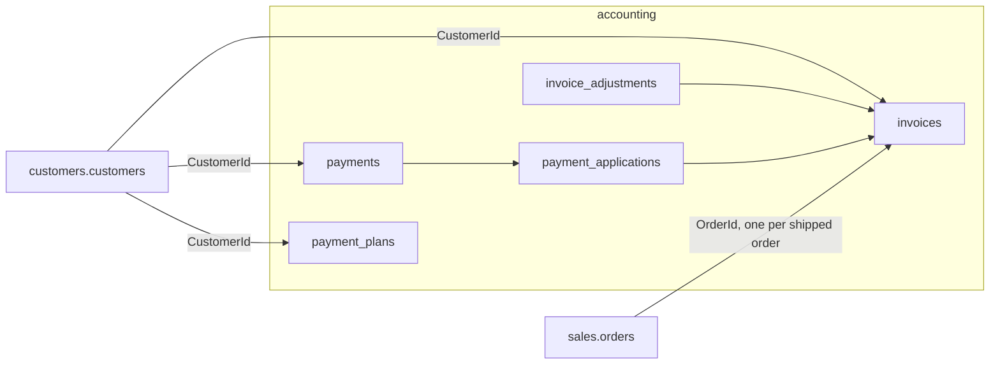

# Accounting — AR (v1 master)

Companion to [`architecture.md`](./architecture.md) §9. That document says Accounting is AR only. This one is **how a customer's receivable is stored, paid, adjusted, and shown** so the internal Accounting tab and the business-wide AR page can be built without re-grilling.

Related: [`invariants.md`](./invariants.md) (§10 A1–A12, G6, G8, G10) · [`customers.md`](./customers.md) (terms, credit limit, account status) · [`tax.md`](./tax.md) (no sales tax) · [`api-contract.md`](./api-contract.md).

Grilled 2026-09-08 against SoloView screenshots on [ADA-328](https://linear.app/adamhinckley/issue/ADA-328/a1-what-ar-jobs-does-the-customer-accounting-screen-own) (Al's Flowers 100076, Customers → Accounting tab; Today's Summary; GL Account Totals). Decisions are closed; this doc is the handoff.

v1 currency is **USD**. Money is integer minor units (`Money`). No float cash anywhere.

---

## 1. Scope

| SoloView screen | Fate in v1 |
|---|---|
| **Customers → Accounting** tab (open AR grid, stats, aging, payment plan, statements, credit entry) | **Build.** Customer Accounting tab (§10) |
| **Today's Summary** (orders booked / shipped / cancelled, Day / MTD / YTD vs last year) | **Not Accounting.** A Sales report over orders; separate Sales packet, not started here |
| **GL Account Totals** (debit / credit by account) | **Out.** General ledger stays excluded (A1, C12). David's GL feeds his accountant; we do not reconcile in this app |

Business-wide Accounting in v1 is an **AR summary** page (§11), not a ledger.

Explicitly out: GL, AP, inventory valuation, sales tax, software subscription money, card charging (Stripe/QuickBooks links stay outside; we **record** results), RMA / replacement selection, auto-dunning.

---

## 2. Data model

### Existing (unchanged shape)

| Table | Role |
|---|---|
| `invoices` | One per shipped order. `total` is merchandise. `dueDate` = posted date + terms. `documentNumber` `INV-#####` |
| `payments` | **Customer-level** money received. `idempotencyKey` unique per org |
| `payment_applications` | Append-only. Payment → invoice, signed amount. Corrections are compensating rows, never updates |

### Changes

| Table | Change | Why |
|---|---|---|
| `invoices` | **Drop** `tax_total_cents`; **drop** table `invoice_tax_lines` | TX2. Dead columns contradicting the locked rule |
| `payments` | Add `method` enum (`check` \| `card` \| `ach` \| `cash` \| `other`), `reference` text null (check #, last 4, txn id), `received_at` timestamp not null (date money arrived; distinct from `created_at`), `note` text null, `recorded_by` staff id null, `voided_at` timestamp null, `voided_by` staff id null, `void_reason` text null | Q5, Q11 |
| `invoice_adjustments` | **New.** `id`, `organization_id`, `invoice_id`, `kind` enum (`write_off` \| `credit_memo`), `amount_cents` (signed; negative reverses), `currency`, `reason` text not null, `recorded_by`, `created_at` | Q7. Reduces remaining; lets bad debt leave the open grid |
| `payment_plans` | **New.** `id`, `organization_id`, `customer_id`, `amount_cents`, `currency`, `frequency` enum (`weekly` \| `monthly`), `starts_on` date, `note` null, `ended_at` null, `created_by`, `created_at`. Partial unique: one row per customer where `ended_at is null` | Q8 |

Customers context (later, with the statement send job — §9): `send_statements` bool, `last_statement_at`.

No stored balances. Open balance, status, aging, and stats are **projections** (U3). No `available_credit` column.

---

## 3. Derived numbers (one definition each)

Let `asOf` default to now; the business-wide page may pass a past date.

**As-of rule.** Every projection below ignores rows dated after `asOf`: invoices with `postedAt > asOf`, payments with `received_at > asOf` (and their applications), adjustments with `created_at > asOf`. Voids are corrections, not events: a voided payment is ignored at every `asOf`. "Today" and "MTD" on the business-wide page mean the `asOf` day and its calendar month, not wall-clock.

| Number | Definition |
|---|---|
| **applied(invoice)** | Σ `payment_applications.amount` where the parent payment is **not voided** |
| **adjusted(invoice)** | Σ `invoice_adjustments.amount` |
| **remaining(invoice)** | `total − applied − adjusted`. Never below 0 (use cases refuse) |
| **status(invoice)** (derived, not stored) | `paid` if remaining = 0; else `past_due` if `dueDate < asOf`; else `partial` if applied + adjusted > 0; else `open`. Precedence in that order |
| **unapplied(payment)** | `amount − Σ its applications`, 0 if voided |
| **unapplied credit(customer)** | Σ unapplied over the customer's payments |
| **open balance(customer)** | Σ remaining(open invoices) − unapplied credit. Show both components beside it |
| **exposure(customer)** | Σ remaining + Σ totals of `confirmed` (not yet shipped) sales orders − unapplied credit |
| **available credit** | `creditLimit − exposure`. May be negative |
| **aging bucket** | For invoices with remaining > 0: `daysPastDue = asOf − dueDate` in whole days. Buckets: **Current** (≤ 0), **1–15**, **16–30**, **31–45**, **46–60**, **61–90**, **90+**. Sum remaining per bucket. One row (days past due), SoloView's edges (Q6) |
| **avg days to pay** | Over fully paid invoices: `received_at` of the application that brought remaining to 0, minus `postedAt`; simple mean |
| **sales(period)** | Σ invoice `total` − Σ `credit_memo` adjustments for invoices with `postedAt` in the period |

Confirmed-unshipped totals come from Sales through a read port (`IOpenOrderExposureReadPort`, to be added in Sales), not a cross-schema join (C10, C11). Last-order date likewise.

### Stats block (customer tab)

Keep SoloView's set (Q10: build all, trim what David does not want). Adds in bold.

Highest Invoice · Avg Invoice · Open Invoice Count · Total Invoice Amount · Credit Memo Count · Total CM · Total Writeoffs · Open Balance · Credit Limit · **Available Credit** · **Unapplied Credit** · Date of First Shipment · Date of Last Shipment · Date of Last Order · Avg Days to Pay · Last YTD Sales (same period last year) · YTD Sales · LYTD vs YTD % · Last Year's Sales · Total Sales.

Dropped: *Invoices Used for Computations* (SoloView's `n`).

---

## 4. Payments (G10 — closed)

| Rule | Decision |
|---|---|
| Record | `RecordCustomerPaymentUseCase`: amount > 0, integer cents, currency matches; `method`, `reference`, `received_at`, `note`; idempotency key required, same key + same payload = no-op success, same key + different payload = `conflict` |
| Allocation | Caller sends explicit `applications[]` (invoice, amount). The UI **prefills** oldest **due date** first (ties: invoice date), each line editable (Q4, Q17). Server validates: each amount ≥ 0, ≤ that invoice's remaining, invoice belongs to this customer and org |
| Remainder | `Σ applications ≤ amount`. Any remainder requires `holdRemainderAsCredit: true`; otherwise `invalid`. Held remainder is **unapplied credit** on the customer (Q4c) |
| Apply credit | Later, staff pick invoices; server appends applications on that payment. Never automatic at ship (Q12) |
| Reallocate | Move amounts between this customer's invoices and unapplied credit without changing the payment total. Append-only: negative and positive application rows in one transaction; per-invoice net never exceeds remaining or drops below 0 (Q11b) |
| Void | Sets `voided_at`, `voided_by`, `void_reason`. Voided payments are ignored by every projection. **Amount is never edited**: wrong amount means void and re-enter (Q11a) |
| Per-invoice record (existing `POST /invoices/:id/record-payment`) | Kept as a thin path into the same use case with one application. `CorrectPaymentUseCase` is superseded by reallocate; remove once the UI does not call it |

Payment plan installments are ordinary payments. Card charging is outside this app.

---

## 5. Adjustments (write-off, credit memo)

`AdjustInvoiceUseCase`: `kind`, signed `amount`, `reason` (required). Positive reduces remaining; negative reverses an earlier adjustment. Bounds: remaining after the row is within `[0, total]`. No RMA, replacement, or restock — that is deferred. Adjustments are visible on the invoice and summed in the stats block.

---

## 6. Payment plan

One active plan per customer: `amount`, `frequency` (weekly | monthly), `starts_on`, `note`. Day of period is implied by `starts_on`.

Derived on read: **next expected date**, **estimated end** = `ceil(open balance ÷ amount)` periods from `starts_on`, and **installments received** = payments with `received_at ≥ starts_on`. A missed installment ("expected Sep 1, not received") is **shown only** — no status change, no block. Plan ends when staff end it or open balance reaches 0 (shows *Complete*). No auto-charge.

---

## 7. Credit limit (G6 — closed)

`available credit = creditLimit − (Σ remaining + Σ confirmed-unshipped order totals − unapplied credit)`.

`$0` limit means **no credit** (card / prepay only), not unlimited.

Enforcement at confirm is a **Sales** rule through `ICreditCheckPort` (U2), in its own packet: wholesale self-service confirm **blocks** when `available < order total`; staff placing on behalf get a loud override confirm (same pattern as sell-anyway). Warn-only is not an option. This doc only defines the formula and shows the number.

---

## 8. Roles (G8 — amended)

New staff role **`accounting`**. New actions and who holds them:

| Action | Covers | admin | accounting | others |
|---|---|---|---|---|
| `payments_apply` (existing) | record payment, apply credit, reallocate | yes | yes | no |
| `ar_adjust` | write-off, credit memo, void payment | yes | yes | no |
| `payment_plans_manage` | create / end plan | yes | yes | no |
| `credit_limit_manage` | edit the customer credit-limit field | yes | yes | no (note: `master_data_manage` no longer grants this alone) |

Read access to invoices and AR stays open to all staff roles. No per-amount thresholds in v1.

---

## 9. Statements (deferred hook, not dead)

A statement is a **PDF projection** of a customer's open invoices plus aging as of a date, delivered through `IEmailSender` when David's email provider is connected. Nothing new in the AR model. When that job is built: `send_statements` flag + `last_statement_at` on the customer, a "Send Statement" action on the tab. Do not overload `Invoice`.

---

## 10. Surface: customer Accounting tab

`/customers/:id?tab=accounting` — sixth tab in `customer-detail-tabs.ts`, after Orders.

| Section | Content |
|---|---|
| **Open AR grid** | Invoice #, Date, Due Date, Order #, Amount, Remaining, Terms, Status (derived). Default: remaining > 0. Toggle **Show Paid**. Row → invoice detail |
| **Aging** | One row, Current / 1–15 / 16–30 / 31–45 / 46–60 / 61–90 / 90+ |
| **Stats** | §3 list, two columns like SoloView |
| **Payment plan** | Active plan fields + next expected / estimated end / installments received; **New Plan** / **End Plan** |
| **Payments** | Recent payments: received date, amount, method, reference, applied / unapplied, void state. Received date opens a large payment-detail dialog (note, applications, void reason). Row actions: **Reallocate**, **Void** (also from the dialog) |
| **Actions** | **Record Payment**, **Apply Credit** (when unapplied > 0), **Adjust Invoice** (from a grid row) |

**Record Payment form:** amount, method, reference, received date (default today), note. Below: the open grid with an editable *Apply* column prefilled oldest-due-first; footer shows *Remaining to allocate* and the checkbox **Hold $X as credit** when > 0. Submit disabled until Σ apply + held = amount.

Follows `work-dashboard-design-spec.md` §12–13 (FieldRow, one control height, Title Case bold buttons with leading icons on table pages).

**Layout prototype (2026-09-08):** three variants live on branch [`prototype/accounting-ar-tab`](https://github.com/adamhinckley/dc-inventory/tree/prototype/accounting-ar-tab) — A ledger, B balance-first, C two-pane payment workbench with the Record Payment allocator always open. Owner leans **C**, refinement pending; see ADA-363. The same branch holds `packages/accounting/prototype/ar-payment-model.prototype.html`, a single-file demo of §3–§7 with the open questions logged on ADA-357.

---

## 11. Surface: business-wide `/accounting`

Replaces the placeholder page. Job: *who owes us, who is late, what came in*; with a past `asOf`, *what AR looked like at month-end*. Balances stay a handoff to the customer Accounting tab (§10). The Payments tab is read-only except **Reallocate** and **Void** from the payment-detail dialog (received-date link). Record Payment, Adjust, and Plan stay on the customer tab. SoloView has no equivalent screen we have seen (§13).

`ExplorerView` like Customers; `RouterTabs` like `purchasing-2-workspace.tsx`. `asOf` is a URL param shared by every section and preserved across tabs.

| Section | Content |
|---|---|
| **Header** | `PageHeader` "Accounting" / "Accounts receivable". Compact `DateInput` for **as-of** (default today) with a *Today* reset |
| **KPI strip** | Four `StatTile`s: Total open AR · **Past due** (amount and % of open) · Unapplied credit · MTD write-offs |
| **Aging strip** | Seven buckets (§3) as one row, all customers. Clicking a bucket filters the Balances table to customers with money in it (`bucket` URL param) |
| **Balances** tab (`/accounting`) | `DataTable`: Customer, Open balance, Past due, Oldest due, Days past due, Credit limit, Available credit, Plan chip. Default sort past-due desc. `DataTable.Search` on customer name / number. Row → `/customers/:id?tab=accounting` |
| **Payments** tab (`/accounting/payments`) | `DataTable`: Received, Customer, Amount, Method, Reference, Applied / Unapplied, Voided chip. Range chips **Today** · **MTD** · **Custom** (`DateRangeInput`), relative to `asOf`. Customer name → customer Accounting tab. Received date → payment-detail dialog (note, applications, void reason; **Reallocate** / **Void** when permitted) |

Two tall tables do not stack on one scroll; hence tabs. Per-customer aging buckets stay on the customer tab, not on the Balances row (§13 if David wants them here). No Record Payment on this page in v1.

**Layout prototype (2026-09-08):** mock-data variants on branch [`prototype/accounting-ar-tab`](https://github.com/adamhinckley/dc-inventory/tree/prototype/accounting-ar-tab) at `/accounting?variant=A|B` — A tabs (this spec), B single scroll. To show David; see ADA-364.

---

## 12. HTTP (internal, behind the `ar` feature guard)

Reuse `internal-invoices.ts` patterns and `schemas.ts` response shapes. All under `/internal`.

| Method / path | Use case |
|---|---|
| `GET /customers/:id/accounting?asOf=` | `GetCustomerAccountingSummary` — stats, aging, unapplied credit, available credit, plan |
| `GET /customers/:id/invoices?includePaid=` | list with derived status and remaining |
| `GET /customers/:id/payments` | list with applications, note, void state, and void reason |
| `POST /customers/:id/payments` | `RecordCustomerPayment` (`applications[]`, `holdRemainderAsCredit`, idempotency key) |
| `POST /payments/:id/reallocate` | `ReallocatePayment` (also serves Apply Credit) |
| `POST /payments/:id/void` | `VoidPayment` |
| `POST /invoices/:id/adjustments` | `AdjustInvoice` |
| `PUT /customers/:id/payment-plan`, `DELETE …` | create / end plan |
| `GET /accounting/summary?asOf=` | `GetAccountingSummary` — totals (open AR, past due, unapplied credit, MTD write-offs) and the aging row. Small payload, no rows |
| `GET /accounting/customer-balances?asOf=&bucket=` | `ListCustomerBalances` — `x-table` list (server sort / page / search) for the Balances tab |
| `GET /accounting/payments?from=&to=` | `ListPaymentsReceived` — `x-table` list for the Payments tab (row also includes note, void reason, applications; those are not table columns) |

The business-wide page is three resources, not one blob: `DataTable` drives from `x-table` list endpoints, and customers-with-balance can be hundreds of rows.

Existing `GET /invoices/:id` and `POST /invoices/:id/record-payment` stay. OpenAPI changes run `pnpm gen:api`; frontends use Orval hooks only.

---

## 13. Still open (do not invent in packets)

| Topic | Owner / next step |
|---|---|
| Which stats David actually reads | Build all (§3); trim after he sees it |
| Does David mail statements today, and to which contact | Ask David before the statement send job |
| Credit-check **override** wording and who may override | Sales packet (G6 enforcement) |
| Auto-apply unapplied credit at ship | Deferred toggle; manual only in v1 |
| RMA / replacement selection | Deferred |
| Today's Summary (orders report) | Sales reporting, separate packet |
| History import of SoloView invoices / payments | L7 in the 2026-09-07 highlights; not this spec |
| SoloView **Accounting** module — what David opens for total AR / aging today | Ask David for a screenshot. The three we have (customer tab, Today's Summary, GL totals) show no business-wide AR screen |
| Per-customer aging bucket columns on the `/accounting` Balances row | Not in v1 (row stays narrow); decide after David sees the prototype |
| **Record Payment** entry point on `/accounting` (pick customer → tab with `?action=record-payment`) | v1.1 candidate; adds an `action` param contract to the customer tab (ADA-363) |
| AR aging **CSV export** as of a date, for David's accountant | Later; pattern is `catalog-csv-download-button.tsx` |

---

## 14. Implementation order (accounting slice)

Payment/AR is owner-gated (AG5, AG6): failing tests are reviewed by the owner before any packet is `ready-for-agent`. Packets live in the Linear project [Accounting — AR](https://linear.app/adamhinckley/project/accounting-ar-526c97835475): [ADA-357](https://linear.app/adamhinckley/issue/ADA-357) → [ADA-359](https://linear.app/adamhinckley/issue/ADA-359) + [ADA-360](https://linear.app/adamhinckley/issue/ADA-360) → [ADA-358](https://linear.app/adamhinckley/issue/ADA-358) → [ADA-361](https://linear.app/adamhinckley/issue/ADA-361) → [ADA-363](https://linear.app/adamhinckley/issue/ADA-363) + [ADA-364](https://linear.app/adamhinckley/issue/ADA-364); [ADA-362](https://linear.app/adamhinckley/issue/ADA-362) after 360.

1. **Domain + use cases (in-memory).** Owner tests for §3–§6: derived status precedence, aging buckets, `RecordCustomerPayment` (allocation bounds, remainder flag, idempotency), reallocate, void, adjustments, plan math. Ports extended on `IInvoiceRepository` / `IAccountingUnitOfWork`; `IOpenOrderExposureReadPort` declared. No schema, no HTTP.
2. **Schema + Drizzle.** Migration: `payments` columns, `invoice_adjustments`, `payment_plans`, drop `invoice_tax_lines` / `tax_total_cents`. `DrizzleInvoiceRepository` implements the new port methods. Postgres integration tests for idempotency race on customer payment.
3. **Read model.** SQL projections for the customer summary and the business-wide summary, customer-balances list, and payments-received list with `asOf` (§3 as-of rule); Sales exposure adapter.
4. **Identity.** `accounting` role, `ar_adjust`, `payment_plans_manage`, `credit_limit_manage`; G8 table and static policy change together.
5. **HTTP + OpenAPI.** §12 routes, `pnpm gen:api`.
6. **Internal UI — customer tab.** §10, Orval hooks only.
7. **Internal UI — `/accounting` page.** §11.
8. **Sales — credit check at confirm.** `ICreditCheckPort` implemented over step 3's exposure; §7 rules. Blocked on 3.

Later, separate: statement PDF + send job (needs email provider); Today's Summary report (Sales); SoloView AR history import.
