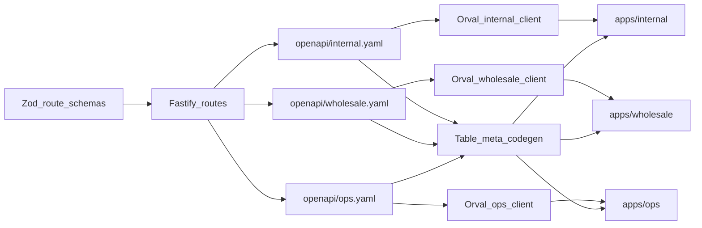

# API contract: OpenAPI, lists, shop, and presentation-only frontends

Companion to [`architecture.md`](./architecture.md), [`stack.md`](./stack.md), [`work-dashboard-design-spec.md`](./work-dashboard-design-spec.md) (internal dashboard tokens; not the shop), [`tax.md`](./tax.md) (no sales tax), [`observability.md`](./observability.md) (ops signals; not part of the UI contract), and [`licensing.md`](./licensing.md) (software billing + flags).

The HTTP API is the **only** contract the UIs may use. Next.js apps are **presentation**. They do not invent query params, compute availability, or assemble filters/charts the spec does not declare.

**Internal** is a staff dashboard (tables, reports, charts, CRUD). **Wholesale** is e-commerce (browse, product detail, cart, checkout, order history). **Ops** is the licensing control plane (subscription, payment history, add-ons, flags) for the software operator and the business owner. Do not reuse `DataTable` as the shop. Do not put flag admin on internal or wholesale.

**Evolvability is required.** Mid-build requirement changes must stay additive and local — see [§7](#7-api-evolution-when-requirements-change) and [`architecture.md` §2a](./architecture.md#2a-change-friendly-api-and-modules).

---

## 1. Contract flow



1. Every route is declared with **Zod** (query, body, params, response). That schema **is** the OpenAPI source — not a handwritten YAML file that drifts.
2. Fastify (`@fastify/swagger` + Zod JSON Schema) **emits three specs**: internal, wholesale, and ops. Wholesale must not list staff-only or ops-only operations. Internal must not list flag admin.
3. `pnpm gen:api` writes `openapi/internal.yaml`, `openapi/wholesale.yaml`, and `openapi/ops.yaml` (committed).
4. **Orval** generates typed TanStack Query hooks + DTOs into `packages/api-client-internal`, `packages/api-client-wholesale`, and `packages/api-client-ops`.
5. A small **table-meta generator** reads `x-table` on **internal** list operations and emits `{ columns, search, filters, sort }` for `DataTable`.
6. Report operations (`x-chart` or a documented series DTO) feed dashboard widgets. Wholesale operations are catalog/cart/checkout — not `x-table`.

CI fails if committed specs do not match the running route schemas (`gen:api` + `git diff --exit-code`).

**Frontends never `fetch` the API by hand.** If a dashboard needs a table, it uses `DataTable` + generated meta + an Orval hook. If it needs a chart, it uses Recharts (or equivalent) on a **report** hook. If the shop needs products, it uses catalog/cart Orval hooks.

---

## 2. Three specs, three generated clients

| Artifact | Used by | Contains |
|---|---|---|
| `openapi/internal.yaml` | Staff dashboard | Commands, lists (`x-table`), reports (`x-chart` / series DTOs), import/export, **feature bootstrap** (read-only names), **issue submit** |
| `openapi/wholesale.yaml` | Client shop | Catalog browse/PDP, cart, checkout, own orders, own account, **feature bootstrap** |
| `openapi/ops.yaml` | Operator / business owner | Subscription, software payment history, add-ons, flag admin, checkout/manual payment, **issue submit** |
| `packages/api-client-internal` | `apps/internal` | Orval hooks, types |
| `packages/api-client-wholesale` | `apps/wholesale` | Orval hooks, types |
| `packages/api-client-ops` | `apps/ops` | Orval hooks, types |
| `packages/ui` | All | Buttons, money/date formatters — **no domain math** |
| `packages/ui-internal` | Staff app only | `DataTable`, filter chrome, chart wrappers |

Orval config: Fastify cookie auth (credentials: `include`), TanStack Query, a shared mutator that points at `apps/api` base URL. Do not generate a second HTTP stack.

---

## 3. List endpoints: search, filter, sort, page

Most **internal** screens are tables. Every **dashboard list** follows the same protocol so agents and the table generator stay accurate. Wholesale product browse is **not** this protocol (see [§4b](#4b-wholesale-shop-operations)).

### Query string (OpenAPI-native)

Use **explicit query parameters**. Do not send a JSON `filters` blob or an OData string — those do not describe themselves in OpenAPI, and frontends would have to guess.

Shared params on every list:

| Param | Type | Meaning |
|---|---|---|
| `q` | `string`, optional | Full-text search over the fields listed in `x-table.search.fields` |
| `page` | `integer`, default `1`, min `1` | Page number |
| `pageSize` | `integer`, default `25`, max `100` | Page size |
| `sortBy` | enum of **that** resource’s sortable fields | Column to sort |
| `sortOrder` | `"asc"` \| `"desc"`, default `"asc"` | Direction |

Resource-specific filters are **first-class query params** with real types (enum, uuid, date-time, integer). Example: `GET /internal/products?q=bolt&status=active&sortBy=sku&sortOrder=asc&page=1&pageSize=25`.

Date ranges are a pair: `createdFrom` + `createdTo` (inclusive), both optional.

### Response envelope

```ts
{
  items: T[]
  page: number
  pageSize: number
  total: number
}
```

No other list shape. No unpaginated “return everything” for tables. Exports (CSV) are a **separate** operation if needed later.

### `x-table` (what the UI is allowed to do)

OpenAPI vendor extension on each list operation. This is how the spec **informs the frontend** which columns, search, and filters exist. The UI does not hardcode a filter form that disagrees with the API.

```yaml
x-table:
  rowId: id
  columns:
    - field: sku
      label: SKU
    - field: name
      label: Name
    - field: onHand
      label: On hand
    - field: onOrder
      label: On order
    - field: allocated
      label: Allocated
    - field: available
      label: Available
  search:
    param: q
    fields: [sku, name]
    placeholder: Search SKU or name
  filters:
    - param: status
      control: select          # select | text | date | dateRange | boolean
    - param: createdFrom
      control: dateRange
      rangePair: createdTo
  sort:
    defaultBy: sku
    defaultOrder: asc
    fields: [sku, name, available, createdAt]
```

`control` tells `packages/ui` which widget to render. Enum values and types come from the **query parameter schema** (do not duplicate enums inside `x-table`).

Codegen turns this into a TS module, e.g. `productsListTable.ts`. `DataTable` takes `{ meta, queryHook }`. Adding a filter is a **backend** change (Zod + `x-table` + repository `WHERE`) plus `pnpm gen:api`. The staff page does not grow a custom filter bar.

### Backend: list is a query use case

A table is not `SELECT *` in a controller.

- `ListProducts` (application) accepts a typed query object: `q`, filters, sort, page.
- A repository port `list(query) → Paged<…>` implements SQL (`ILIKE` / `pg_trgm` for `q`, `WHERE` for filters, `ORDER BY`, `LIMIT`/`OFFSET`).
- Controllers: parse query with Zod → call the use case → return the envelope.

**Search in v1 is Postgres**, not Elasticsearch. Enable `pg_trgm` for `q` on columns that `x-table.search.fields` names. Keep `q` semantics documented per endpoint (which columns; case-insensitive).

**Availability on a product table:** the frontend must not join “catalog + inventory” with two hooks and subtract. A list that shows `onHand` / `onOrder` / `allocated` / `available` is a **query use case** that reads Catalog plus the Inventory **read model** (or a dedicated list read model in the API’s query adapter). The numbers still come from Inventory’s snapshot, not a qty column on `products`.

Wholesale **order history** may be a simple paginated list (`page` / `pageSize`) without full `x-table` chrome. Session `customerId` is applied in the adapter/use case, not offered as a query param. Product browse uses catalog search/filter params suited to a shop (category, q, sort), not staff DataTable meta.

---

## 4. Commands vs lists

| Kind | HTTP | OpenAPI | Frontend |
|---|---|---|---|
| Query / table (internal) | `GET …` with list protocol | `x-table` required | `DataTable` + Orval query hook |
| Report / chart (internal) | `GET /internal/reports/…` | Series + optional KPI DTO; optional `x-chart` | Recharts (or wrapper) on Orval hook |
| Shop browse (wholesale) | `GET /wholesale/catalog` | Shop filters (`q`, category, sort) — **no** `x-table` | Product grid |
| Cart / checkout | `GET/POST/PATCH /wholesale/sales-orders`, `POST /wholesale/sales-orders/:id/confirm` | Sales order DTO (`status: draft` = cart, optional `label`) | Cart drawer, `/cart`, `/cart/[id]`, checkout |
| Export | `GET …/export?format=csv\|xlsx` **plus the same list filters** (no `page` / `pageSize`, documented row cap) | `application/vnd.openxmlformats-officedocument.spreadsheetml.sheet` / `text/csv` | Orval **blob**; internal `DataTable` export button |
| Import template | `GET …/import-template?format=xlsx` | blob | Download link |
| Import dry-run | `POST …/import?dryRun=true` multipart file | JSON `{ rowsOk, errors[] }` | File picker + error table |
| Import commit | `POST …/import` multipart file | JSON `{ created, updated, errors[] }` | Confirm after dry-run |
| Get one | `GET …/:id` | No `x-table` | Orval query hook |
| Command | `POST` / `PATCH` / `DELETE` | Request/response Zod | Orval mutation hook + form |
| Generated PDF | `GET …/:id.pdf` (or `/document`) | `application/pdf` | Orval blob + download / new tab |
| Attachment upload | `POST …/:id/attachments` multipart | metadata + storage key | Staff file picker |

`x-table` may include `export: { formats: [csv, xlsx] }` and `import: { template: true }` so the table chrome can show buttons without a one-off toolbar.

Orval must generate **blob** clients for export/PDF. The UI must not parse XLSX in the browser to “help.”

---

## 4a. Files on the wire

- Max upload size declared in OpenAPI and enforced in Fastify (spreadsheets smaller than images; PDFs capped).
- Allowlist MIME types: `text/csv`, `application/vnd.ms-excel`, `application/vnd.openxmlformats-officedocument.spreadsheetml.sheet`, `application/pdf`, image types already used for catalog.
- Import errors are **row-addressable** in JSON so the presentation table can highlight them. Do not return a 200 with a silent skip.
- Wholesale: order PDFs / their invoices only if the wholesale spec includes the operation; no Catalog/Inventory import, no staff reports on `/wholesale`.

---

## 4b. Wholesale shop operations

The wholesale spec is an **ordering API**, not a cut-down admin:

| Operation | Role |
|---|---|
| `GET /wholesale/catalog` | Browse: `q`, category, pagination, sort (shop-relevant). Default `availableOnly=true` lists sellable SKUs only (open: every open SKU; locked: `availableToSell` > 0). Response includes image URLs, wholesale price, `available`, `availableToSell`, and `sellState` for shop sellability display. |
| `GET /wholesale/catalog/categories` | Category names that have at least one shop-visible product (sidebar, header dropdown). |
| `GET /wholesale/catalog/:id` | Product detail (`sku`, `description` included on list and detail DTOs) |
| `GET /wholesale/sales-orders?status=draft` | The customer's open carts. Every draft is a cart; the shop keeps the *active* one client-side. |
| `POST /wholesale/sales-orders` | Always opens a **new** draft (`lines`, optional `label` ≤ 80 chars). No find-or-create. |
| `PATCH /wholesale/sales-orders/:id` | Replace lines; `label` omitted keeps, `null` clears, string renames. Empty `lines` cancels that cart only. |
| `POST /wholesale/sales-orders/:id/confirm` | Place order (Sales confirm + Inventory allocate). |
| `GET /wholesale/sales-orders` | Own order history (paginated; session `customerId`) |
| `GET /wholesale/sales-orders/:id` | Own order detail by UUID |
| `GET /wholesale/sales-orders/by-document-number/:documentNumber` | Own order detail by `documentNumber` (404 for draft or another customer) |

Do not generate `x-table` for these. Do not expose `/internal/reports/*` on the wholesale spec.

---

## 4c. Internal reports (charts)

`GET /internal/reports/:name` with explicit query params (`from`, `to`, `granularity`, …). Response is KPIs + series (see architecture). Optional `x-chart`:

```yaml
x-chart:
  type: line          # line | bar | pie | kpi
  xLabel: Week
  yUnit: cents        # cents | count | quantity
```

The dashboard home is a few of these endpoints plus KPI cards — not a BI tool. Adding a chart means adding a report use case, not summing table rows in React.

Zod request bodies for commands are the form contract. Prefer generating form fields from the schema (or a thin `x-form` later). v1 may hand-layout forms **as long as** they submit only Orval-typed bodies — no extra fields.

---

## 5. What frontends are allowed to do

**Allowed**

- **Internal:** routes, `DataTable`, KPI cards, Recharts on **report** hooks, CRUD forms, hide nav from feature bootstrap, **report an issue** (not a ticket inbox).
- **Wholesale:** browse grid, product detail, cart, checkout, order history, hide nav from feature bootstrap.
- **Ops:** subscription, payment history, add-on purchase, operator flag overrides, **report an issue**.
- Call Orval hooks with params that exist on the generated type.
- Map labels, dates, money **for display** (formatting only; minor units stay integers until a formatter).
- Trigger Orval blob downloads (export, PDF). Upload files via generated multipart hooks.

**Forbidden**

- Hand-written `fetch` / axios to `apps/api`.
- Query params not in the generated client.
- Computing `available` (or any stock figure) in the UI.
- Computing sales tax (`price * rate`, hardcoded percents, `taxTotal`).
- Charting by fetching list pages and reducing them in the browser.
- Putting `DataTable` on the wholesale shop as the catalog.
- Filtering a full dataset in the browser because the list endpoint “doesn’t support it yet” — add the filter to the API instead.
- Parsing CSV/XLSX/PDF in the browser, or exporting only the current page of a table.
- Importing `packages/*/domain` or Drizzle schemas.
- Flag admin, complementary grants, or software checkout from `apps/internal` or `apps/wholesale`.
- A flags SDK (LaunchDarkly, etc.) in a frontend. Bootstrap is a generated Orval hook.
- A helpdesk or operator-platform dashboard inside this product. Issue submit is a form; the inbox is the other repo.

---

## 6. Agent rules

When adding or changing a table:

1. Extend the list Zod schema (new filter param with a real type).
2. Update `x-table.filters` / `columns` / `sort.fields`.
3. Implement `WHERE` / search columns in the repository (unit-test the query use case with an in-memory list, or a focused SQL test).
4. Run `pnpm gen:api`.
5. Point the page at the regenerated hook + meta. Do not add a one-off filter component.

Do not introduce GraphQL, tRPC, a generic `?filter=JSON` query language, Elasticsearch, or a BI tool (Metabase/Superset) in v1.

---

## 7. API evolution (when requirements change)

Stakeholders will change their mind mid-build. The HTTP contract is designed so those changes are **routine**, not architectural events. Module-level seams are in [`architecture.md` §2a](./architecture.md#2a-change-friendly-api-and-modules).

### Design goal

An API that is easy to **extend and rebuild on**: new fields, filters, commands, and reports land as additive OpenAPI changes; business-rule flips stay in use cases; frontends only regenerate clients.

### Evolution policy (v1)

| Change | How to do it | Do not |
|---|---|---|
| Add a response field | Optional (or always-present with a safe default) on the Zod response; regenerate both specs/clients as needed | Remove or rename an existing field the same day |
| Add a list filter / column / sort | New typed query param + `x-table` + repository support + `pnpm gen:api` | Hardcode a filter in React, or send a JSON `filters` blob |
| Add a command | New `POST`/`PATCH`/`DELETE` with its own Zod body; one use case | Overload an existing endpoint with a `mode` / `action` string |
| Add a report / chart | New `GET /internal/reports/…` + series DTO | Aggregate table pages in the browser |
| Change DTO shape for one audience | Map in that audience’s HTTP adapter; keep the use case | Fork `PlaceOrder` into staff vs client variants with duplicated rules |
| Change a business rule | Update use case + unit tests; change Zod only if the wire contract must change | Patch the rule only in a controller or a single page |
| Breaking rename / remove | Add the replacement; migrate Orval call sites; delete the old field/route in a follow-up when unused | `/v2` of the whole API for a single field rename |

### Additive-first (no global `/v1` tax)

v1 does **not** version the entire surface as `/v1` vs `/v2`. Paths stay under `/internal/…`, `/wholesale/…`, and `/ops/…`. Compatibility is:

1. **Additive OpenAPI** — new operations and optional fields.
2. **Parallel operations** when a shape must break — e.g. keep `POST /internal/products` and add `POST /internal/products:import` rather than silently changing multipart meaning.
3. **Short dual-publish** only when migrating — old and new field together for one release, then remove the old after both apps use the new one.

Internal, wholesale, and ops specs version **independently**. A breaking staff-dashboard change must not force a wholesale or ops client bump.

### Recipe: stakeholder asks for “just one more filter”

```
1. Zod query: add typed param (enum / uuid / date / boolean)
2. x-table.filters: add control + param name
3. List use case + repository: honor the filter (in-memory test first)
4. pnpm gen:api  → commit openapi/*.yaml
5. Internal page: regenerated meta + hook — no custom filter bar
```

### Recipe: stakeholder flips a rule (“invoice on ship, not on confirm”)

```
1. Owner/agent updates the failing unit test for the Accounting (or Sales) use case
2. Change the use case only
3. Touch HTTP Zod only if request/response meaning changes
4. Do not add a frontend-only branch that invents invoice timing
```

### Recipe: stakeholder wants a different JSON name on the shop only

```
1. Keep the shared use case response as domain/application types
2. Map field names in the wholesale controller / presenter
3. Regenerate wholesale OpenAPI + Orval client
4. Leave internal DTO alone unless staff asked too
```

### Contract checklist for evolvability

- [ ] Change is additive, or has a parallel route + migration plan
- [ ] Business rule updated in **one** use case (or domain VO), not in React
- [ ] Internal, wholesale, and ops specs only changed where that audience needs it
- [ ] `pnpm gen:api` run; committed YAML matches Zod
- [ ] No hand-written `fetch`; no new API paradigm (GraphQL/tRPC/JSON filters)
- [ ] Inventory/money/authz flips stay owner-gated per architecture autonomy map

---

## 8. Folder map (contract artifacts)

```
openapi/
  internal.yaml              # committed, generated
  wholesale.yaml
  ops.yaml
packages/
  api-client-internal/       # Orval output
  api-client-wholesale/
  api-client-ops/
  ui/                        # shared formatters
  ui-internal/               # DataTable + chart wrappers
apps/
  api/                       # Fastify + swagger export
  internal/                  # staff dashboard
  wholesale/                 # e-commerce shop
  ops/                       # licensing control plane
```
