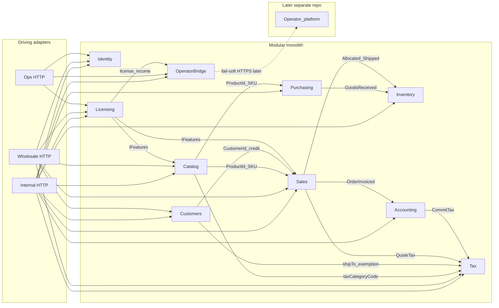
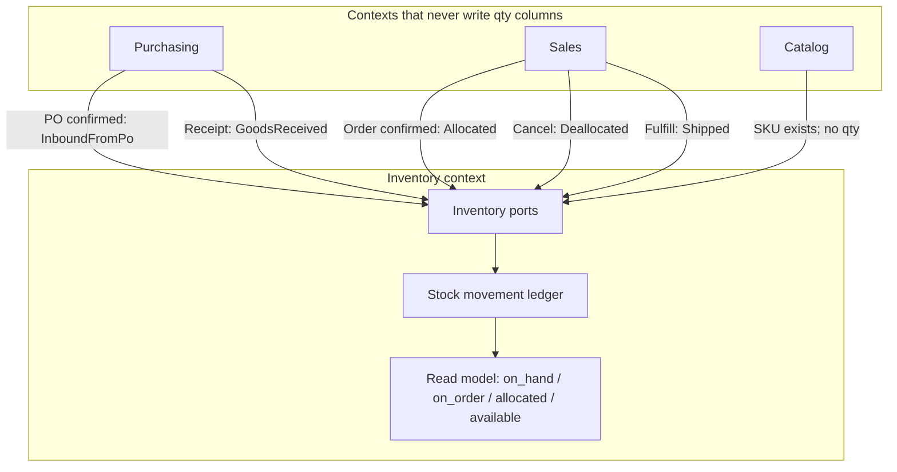
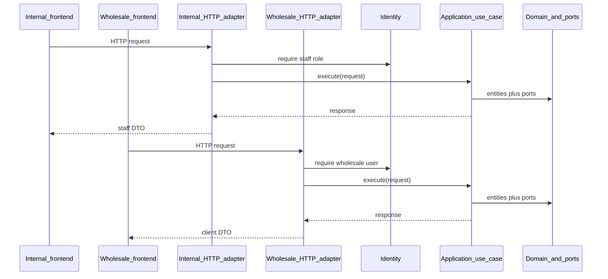

# Backend Architecture

Source of truth for how this system is structured, what each module owns, and how **coding agents** (any vendor that can clone the repo and open a PR) are allowed to work in it.

This document describes **architecture only**. Application code, CI, and `AGENTS.md` come after this contract is accepted.

Related: [`stack.md`](./stack.md) (runtime, Postgres, auth) · [`database-design.md`](./database-design.md) (rough-draft schema + relations for stakeholder review) · [`api-contract.md`](./api-contract.md) (OpenAPI, Orval, tables, shop, reports) · [`tax.md`](./tax.md) (quote/commit tax engine, exemptions, fail-closed) · [`observability.md`](./observability.md) (logs, errors, uptime, agent-actionable alerts, low cost) · [`invariants.md`](./invariants.md) (locked rules + gaps the initial plan still needs to close) · [`licensing.md`](./licensing.md) (software subscription, paid add-ons, feature flags, ops dashboard) · [`operator-bridge.md`](./operator-bridge.md) (door to the developer’s other monorepo: income, licenses, issue reports).

---

## 1. What we are building

Wholesale inventory control for a business that:

- Maintains a product catalog (including images)
- Tracks stock on hand, stock on order (purchase orders), and quantity clients have already ordered
- Surfaces **available** quantity for any SKU
- Creates and receives purchase orders
- Lets wholesale clients place orders from a dedicated frontend
- Manages customers (accounts, contacts, terms, credit, ship-to, tax exemption certificates)
- Handles a thin slice of accounting (invoices **with committed tax**, payments, AR)
- Pays the **software operator** (developer) via a subscription, with a payment history and optional paid add-ons, gated by feature flags
- Leaves a **fail-soft door** to the operator’s separate business repo (income, active licenses, customer issue reports) — [`operator-bridge.md`](./operator-bridge.md)

**Who this is for.** The **customer organization** is a multi-employee wholesale company: staff in different roles (purchasing, warehouse, sales support, admin), many wholesale client accounts with their own users, suppliers/vendors, and occasional data exports for an external accountant. This is not a one-person shop dressed up as wholesale.

**Who builds it.** A **solo software operator** (the product owner / engineer) is building and running this stack largely alone, with coding agents — because the company wants a better system than what they have today. “Solo” describes **software ops and the build team**, not headcount at the wholesale business.

The backend serves **two products plus an operator control plane**, not two skins of the same admin:

| App | Audience | What it is |
|---|---|---|
| **Internal** (`apps/internal`) | Staff | **Dashboard**: tables with search/filter, reports, charts, CRUD for catalog/POs/stock/customers/invoices |
| **Wholesale** (`apps/wholesale`) | Clients | **E-commerce ordering**: browse, product detail, cart, checkout, order history — not a spreadsheet UI |
| **Ops** (`apps/ops`) | Software operator + business owner | **Licensing control plane**: subscription, payment history, paid add-ons, feature-flag admin. Not a warehouse UI. Details: [`licensing.md`](./licensing.md). |

One backend. Three HTTP adapters (`/internal`, `/wholesale`, `/ops`). Shared use cases. Different OpenAPI specs and generated clients. Tables/`DataTable` are an **internal** pattern. Wholesale uses catalog/cart/checkout screens. Ops is extractable later (same Licensing ports) without splitting inventory.

---

## 2. Constraints that drive every decision

**Solo software operator (build + run).** There is no DevOps team, no SRE, and no second code reviewer except the product owner. Operational surface stays tiny: one deployable app, one Postgres, object storage for images. Observability stays on free/near-free tiers and must produce **agent-actionable** incident packets — see [`observability.md`](./observability.md). The wholesale company’s employees use the product daily; they are not expected to babysit the infrastructure.

**Coding agents build features.** Architecture is a set of hard module seams so an agent — Cursor, Codex, Claude Code, Copilot, Devin, or anything else that works from a git checkout — can complete a slice without loading the whole system. The owner reviews inventory, money, and auth. Agents own adapters, CRUD, and UI wiring once ports and tests exist. The repo contract is `AGENTS.md` + these docs, not a single vendor’s product.

**Two products plus ops, one backend.** Shared use cases; different controllers, auth, DTOs, and UX. Internal is a dashboard; wholesale is a shop; ops is licensing/flags for the operator and the business owner only.

**Complex availability is a projection.** Stock on hand, stock on order, allocated-to-clients, and available are **not** independent columns that get mutated in three places. They are derived from a stock ledger. See [§6](#6-inventory-stock-ledger-not-a-qty-column).

---

## 3. Shape: modular monolith

This is a **modular monolith**, not a set of microservices.

- One process, one database, one deploy.
- Bounded contexts are **packages** with their own domain, use cases, and adapters.
- Clean Architecture **inside each context**: dependencies point inward; domain and use cases never import adapters or frameworks.
- Cross-context collaboration is via **ports** (interfaces) and **in-process domain events**, not shared entities.
- A transactional outbox / message bus for **inventory or wholesale AR** is not v1. The operator-platform **bridge** may use a small local queue table so this app can notify a *separate* developer repo later without blocking stock or checkout — [`operator-bridge.md`](./operator-bridge.md).

Microservices would split the inventory consistency this product depends on, and would turn the solo software operator into an SRE. Extract a context later only if a real operational reason appears.

### Stack

Concrete choices (TypeScript monorepo, Fastify, Postgres, Drizzle, Better Auth, Next.js apps) live in [`stack.md`](./stack.md). That document also covers **why Postgres**, how **sessions and the audiences** are isolated, and what agents must not add.

The module map and inventory model do not depend on Fastify vs another HTTP library; they **do** depend on an ACID database, a session that binds `customerId` on the server, and a Licensing port (`IFeatures`) so paid capability is not hardcoded in every use case.

### v1 scope locks

| Concern | v1 | Explicitly later |
|---|---|---|
| Warehouses | One warehouse, modeled as `LocationId` currently `DEFAULT` | Multi-location ATP |
| Available qty | `on_hand - allocated` | Sell against inbound POs |
| Accounting | Invoices, payments, AR **of wholesale customers** | General ledger |
| Tax | Quote at checkout, commit on invoice post, hosted engine behind `ITaxCalculator` | Return filing, use tax on POs, certificate-lifecycle CMS |
| Software billing | Licensing context + payment history + `IFeatures`; Stripe optional (manual record works) | Multi-tenant SaaS, LaunchDarkly as required runtime, Stripe Connect marketplace |
| Operator platform | `IOperatorPlatform` no-op + local issue/outbox tables | HTTPS to the other monorepo; bidirectional tickets |
| Stock identity | SKU | Product variants as a first-class model |
| Events | In-process (domain). Operator bridge: local queue, fail-soft | Kafka / inventory outbox / broker |
| Deployables | One API process; `apps/ops` may live in this repo | Split ops UI; **operator platform stays a different repo** |

---

## 4. Bounded contexts

Each context owns a coherent model and a ubiquitous language. Other contexts may hold an **ID** or a **snapshot**, never the foreign aggregate.



| Context | Owns | Does not own | Agent autonomy |
|---|---|---|---|
| **Identity** | Staff vs wholesale vs **ops** users, credentials, roles, sessions | Customer credit, product data, plan prices | Medium — owner reviews authz |
| **Licensing** | Software subscription, **payment history to the developer**, paid add-ons, `IFeatures` | Wholesale AR, inventory qty, catalog SKUs | Low for billing/webhooks; high for “gate this route” once a flag exists |
| **Catalog** | SKU, name, description, images, list/wholesale price, `taxCategoryCode` | Stock counts, tax rates | **High** |
| **Inventory** | Stock **ledger**, ATP read model, `LocationId` | Product marketing copy, order totals | **Low** — owner specifies tests first |
| **Purchasing** | Suppliers, purchase orders, receiving | On-hand qty (emits `GoodsReceived`) | Medium |
| **Sales** | Wholesale orders, line items, status | Customer master beyond `CustomerId`; live stock | Medium — allocation is gated |
| **Customers** | Accounts, contacts, terms, credit limit, ship-to, exemption **files + metadata** | Invoices, tax math | **High** (exemption **enforcement** gated) |
| **Tax** | `ITaxCalculator` quote/commit/void, frozen tax lines, engine transaction ids | Customer master, AR balance, filing returns | **Low** — owner specifies tests first |
| **Accounting** | Invoices, payments, AR **owed by wholesale customers**; copies committed tax onto the invoice | Full GL, inventory valuation, **software** subscription, tax engine HTTP | Low–medium — money paths gated |
| **Operator bridge** | Envelope to the developer’s **other** repo: license snapshot, income, issue reports, heartbeat | Inventory, customer AR, flags, helpdesk UI | High for no-op; owner reviews HTTPS secrets |

### Anti-corruption (required)

Sales **never** imports Catalog’s `Product` entity. It uses a `ProductSnapshot` (sku, name, unit price at order time) obtained through a port. Purchasing does the same for supplier-facing product identity.

Sales and Accounting hold `CustomerId`, not a Customer aggregate. Credit-limit checks go through a Customers port, not a shared table join in the use case.

Sales and Accounting **never** compute tax. They pass address, line, and exemption **snapshots** into Tax ports. Catalog stores `taxCategoryCode`, not a rate. See [`tax.md`](./tax.md).

Inventory is the **only** writer of quantities. Catalog, Purchasing, and Sales call Inventory ports or emit events that Inventory handles. They do not `UPDATE stock SET qty = ...`.

Licensing is the **only** writer of software entitlements and software payment history. Accounting does not store “they paid the developer.” Catalog does not store paid add-ons as products. Other contexts **read** `IFeatures` / `FeatureName` only — they do not import `Subscription` or Stripe types. See [`licensing.md`](./licensing.md).

The developer’s multi-product business repo is **not** a context in this monolith. This app talks to it only through `IOperatorPlatform` after local commit. See [`operator-bridge.md`](./operator-bridge.md).

### Shared kernel (tiny)

The only types allowed to be imported across contexts:

- `Money` (integer minor units + currency; validated at construction)
- `Sku`
- Typed IDs (`ProductId`, `CustomerId`, `OrderId`, `PurchaseOrderId`, `LocationId`, `TenantId`, `AddOnId`, `InstallationId`, …)

Nothing else. If two contexts need the same concept, copy a snapshot or add a port. Do not grow the shared kernel.

---

## 5. Layers per context (dependency rule)

Every bounded context follows the same rings. **Every `import` in `domain/` and `application/` must point only toward `domain/`** (or the shared kernel). Those layers must never import `adapters/`, HTTP frameworks, ORM models, or S3 SDKs.

```
packages/<context>/
  domain/           # entities, value objects, ports (interfaces)
  application/      # use cases — orchestrate domain, no I/O details
  adapters/         # Postgres, HTTP controllers, S3, in-memory fakes
  tests/
    unit/           # use cases + in-memory adapters (no Docker, no network)
    integration/    # optional; real Postgres for adapter mapping only
```

| Layer | Allowed to know | Forbidden |
|---|---|---|
| Domain | Entities, VOs, ports, domain events | Frameworks, SQL, HTTP, config files |
| Application (use cases) | Domain only | Concrete repositories, Stripe, S3, Fastify/Nest |
| Adapters | Domain + application + infrastructure | Putting business rules in controllers |
| Infrastructure wiring | Everything (DI composition root) | Being imported by domain/use cases |

A controller does three things only: parse the request, call one use case, map the response.

A repository persists and reconstitutes an aggregate. It does not orchestrate other use cases.

### Ports that will exist early

| Port | Owned by | Typical adapters |
|---|---|---|
| `IProductRepository` | Catalog | Postgres, in-memory |
| `IFileStorage` | Shared port (images, attachments, generated PDFs) | S3, local disk, in-memory |
| `IWorkbookParser` / `IWorkbookWriter` | Adapters used by import/export use cases | CSV, XLSX, in-memory rows |
| `IPdfRenderer` | Purchasing / Accounting (PO, invoice PDFs) | PDFKit (or equivalent), fake bytes in tests |
| `IStockLedger` / `IInventoryReadModel` | Inventory | Postgres (same transaction), in-memory |
| `IPurchaseOrderRepository` | Purchasing | Postgres, in-memory |
| `ISalesOrderRepository` | Sales | Postgres, in-memory |
| `ICatalogProductPort` | Sales / Purchasing (ACL) | In-process Catalog adapter, later HTTP if split |
| `ICustomerRepository` | Customers | Postgres, in-memory |
| `ICreditCheckPort` | Sales | In-process Customers adapter |
| `ITaxCalculator` | Tax | In-memory (tests), hosted engine (AvaTax or equivalent) |
| `IInvoiceRepository` | Accounting | Postgres, in-memory |
| `IFeatures` | Licensing (read) | Postgres projection, in-memory |
| `IEntitlementRepository` | Licensing | Postgres, in-memory |
| `ISoftwarePaymentRepository` | Licensing | Postgres, in-memory |
| `ISoftwareBillingGateway` | Licensing | Manual record, Stripe, in-memory |
| `IFeatureFlagAdmin` | Licensing (ops writes) | Postgres, in-memory |
| `IOperatorPlatform` | Operator bridge (outbound) | No-op, later HTTPS |
| `IOperatorOutbox` | Operator bridge | In-memory, Postgres queue table |
| `IIssueReportRepository` | Operator bridge | Postgres, in-memory |

In-memory adapters are not optional. They are how unit tests and coding agents verify a slice without Docker.

---

## 6. Inventory: stock ledger, not a qty column

This is the hard problem. Get it wrong and every screen that shows “available” will drift. The full invariant checklist (including open ATP/credit/state-machine decisions) is [`invariants.md`](./invariants.md).

### Source of truth

**Stock movements** are the source of truth. The availability snapshot is a **read model** updated in the **same database transaction** as the movement (v1 — no eventual-consistency gap on the number staff and clients see).

Movement types:

| Movement | Effect |
|---|---|
| `InboundFromPo` | Increases `on_order` when a PO is placed/confirmed |
| `GoodsReceived` | Decreases `on_order`, increases `on_hand` |
| `Allocated` | Increases `allocated` when a sales order is confirmed |
| `Deallocated` | Decreases `allocated` on cancel / reject |
| `Shipped` | Decreases `allocated` and `on_hand` |
| `Adjustment` | Explicit on-hand correction (shrink, count, damage) |

### Read model (what UIs show)

For each `(sku, locationId)`:

```
on_hand     = receipts − shipments − adjustments
on_order    = open PO qty not yet received
allocated   = open sales-order qty not yet shipped
available   = on_hand − allocated
```

**v1 policy:** inbound PO qty is **shown**, not **sellable**. Clients cannot order against stock that has not been received. Changing that policy later is a new projection rule, not a rewrite of the ledger.

`available` is never written by a use case as a raw field. It is computed (or stored only as a derived column maintained by the Inventory adapter).



### Aggregate heuristic

- **Stock ledger + per-SKU snapshot** live in Inventory. Do not put on-hand on `Product` or on `SalesOrder`.
- **PurchaseOrder** is its own aggregate (Purchasing). Receiving records a receipt against the PO, then Inventory records `GoodsReceived`.
- **SalesOrder** is its own aggregate (Sales). Confirming it asks Inventory to allocate; Inventory may reject if `available` is insufficient.
- Customer does not contain orders. Order holds `CustomerId`.

If a use case needs both an order and a stock number, it is an **application** use case that talks to two ports, not a reason to merge aggregates.

---

## 7. Three HTTP adapters, same use cases

The frontends are **driving adapters**, not extra backends. They are **presentation only**: OpenAPI (from Zod) is the contract; **Orval** generates TanStack Query clients. Internal tables use `x-table`; internal charts use **report query** endpoints (aggregated series — never 10k rows charted in the browser). Wholesale is shop UI over catalog/cart/checkout operations. Ops is the licensing control plane. Details: [`api-contract.md`](./api-contract.md), [`licensing.md`](./licensing.md).

```
/internal/...     staff session, full command + list surface
/wholesale/...    wholesale-client session, scoped to that customer
/ops/...          operator / business-owner session, licensing only
```



Rules:

- Wholesale adapters **force** `customerId` from the session. Clients cannot pass another account’s id. Checkout **quotes tax** via Tax ports; the shop does not compute tax.
- Wholesale catalog reads may return price, images, and `available`; they never return cost, supplier, or other customers’ orders. Cart and checkout call Sales use cases with `customerId` from the session.
- Internal **reports** are query use cases that return KPIs and chart series (bucketed in Postgres). The dashboard does not download a list and aggregate in React.
- Internal adapters may call the same `PlaceOrder` / `GetAvailability` use cases with staff privileges (e.g. place an order on behalf of a customer).
- Gated capabilities check `IFeatures` at the adapter (or a use-case decorator), then still `403` if someone calls the route anyway. Internal/wholesale get a **bootstrap list** of enabled flag names, not flag admin.
- Ops adapters call Licensing use cases only. They do not expose inventory, catalog CRUD, or staff reports. Issue submit on ops/internal goes to the **operator bridge**, not Accounting.
- Operator-platform HTTP is **outbound from adapters**, fail-soft. Domain use cases do not `fetch` the other repo.
- Do not duplicate business logic in controllers. If adapters need different shapes, map DTOs — do not fork the use case.
- List/table screens are `GET` query use cases with a shared pagination envelope and explicit filter query params. Controllers do not build SQL. Frontends do not filter full datasets in the browser.
- Spreadsheet import/export and generated PDFs go through file ports. The UI only uploads/downloads; it does not parse Excel or build PDFs in the browser.

### Files: images, spreadsheets, PDFs

Bytes live in object storage (`IFileStorage`). Postgres stores **metadata and object keys**, never workbook or PDF blobs.

| Kind | v1 | Not v1 |
|---|---|---|
| **Product images** | Staff upload; Catalog metadata | — |
| **Spreadsheet export** | CSV + XLSX of the **current table query** (same filters as the list, no browser-side export of a page of rows) | Emailing giant dumps, Excel macros |
| **Spreadsheet import** | CSV + XLSX → **dry-run then commit**. Rows become the same commands as the UI (create product, etc.) | Silent partial imports with no error report |
| **Generated PDFs** | Purchase order and invoice **rendered from our aggregates**, stored on the document, downloadable | Pixel-perfect designer tooling |
| **Inbound PDFs / scans** | Attach the file to a PO or invoice (staff uploaded it); **exemption certificates** on the customer | **OCR / parsing a supplier’s PDF into line items** — layouts vary; that is a later project |
| **Templates** | Downloadable import template per resource (`GET …/import-template`) | Customer-specific Excel mappings in v1 unless one mapping is truly required |

**Import is a use case, not a SQL dump.** Parse (`IWorkbookParser`) → validate each row → return `{ rowsOk, errors: [{ row, field, message }] }`. Commit runs existing create/update use cases. Imports **must not** write `available` or raw on-hand; a stock count import is an `Adjustment` movement and is owner-gated.

**Export reuses the list query.** `GET /internal/products?…&format=xlsx` (or a sibling `/export`) uses the same filters as the table, with a higher row cap than `pageSize` (document the cap, e.g. 10_000; async jobs later if that is too small). Money stays integer minor units in the file or a single documented decimal format — pick one per export and test it. Do not invent tax in the spreadsheet; export frozen invoice tax amounts.

**Purchase orders are data first.** The PO aggregate in Postgres is the source of truth. A PDF is a **projection** we generate when someone needs to send or print it (`IPdfRenderer` → `IFileStorage` → key on the PO). If a supplier emails a PDF, v1 stores it as an attachment; a human (or a later parser) enters the lines. Do not block Purchasing on PDF intelligence.

Wholesale may download **their** invoices/order PDFs if the wholesale spec includes the operation. They never import into Catalog or Inventory, and they do not get staff DataTables or report charts.

### Internal dashboard: reports and charts

Charts are **not** a frontend aggregation of table pages. Each visualization has a **report query use case** that returns a small, already-bucketed payload:

```ts
{
  generatedAt: string
  kpis?: { key: string; value: number; unit?: string }[]
  series: { name: string; points: { x: string; y: number }[] }[]
}
```

v1 reports (internal spec only):

| Report | Purpose |
|---|---|
| Dashboard summary | Open orders, low-stock SKU count, AR balance, inbound PO count |
| Sales over time | Confirmed/shipped order totals by day/week (query: `from`, `to`, `granularity`) |
| Orders by status | Counts for a pipeline chart |
| Inventory snapshot | On-hand / on-order / allocated / available **totals or top-N SKUs** — from the Inventory read model |
| AR aging | Simple buckets (current / 30 / 60 / 90) once invoicing exists |

`y` for money is **integer cents**. The chart library only formats for display.

Add a report when a dashboard tile needs it — do not add a general-purpose “query builder” or embed Metabase/Superset in v1.

---

## 8. Identity and authorization

Three actor types in one Identity context:

| Actor | Authenticates how | Authorized for |
|---|---|---|
| Staff | Internal login | `/internal/*` plus role checks (admin, purchasing, warehouse, …) |
| Wholesale user | Client login, bound to `CustomerId` | `/wholesale/*` for that customer only |
| Operator / business owner | Ops login | `/ops/*` — licensing, payment history, flags. Operator: full. Business owner: subscribe/pay/history, not complementary force-on. |

Authorization lives at the adapter edge (middleware / guards) and, for money and stock mutations, as explicit checks in use cases where the invariant is a business rule (e.g. credit limit). Do not sprinkle `if (role)` inside domain entities. Feature flags are **Licensing**, not a second RBAC matrix inside every entity.

Coding agents may implement login/session adapters. **Permission matrices, credit/stock gates, and licensing/flag catalogs are owner-reviewed.**

---

## 9. Accounting (v1)

Accounting is **AR only** — money **wholesale customers owe the company**:

- Invoice created from a confirmed/shipped sales order (policy: invoice on confirm vs on ship — pick one in the first Accounting use case and keep it).
- **Tax is committed when the invoice posts** (`ITaxCalculator.commit`). The invoice stores `subtotal`, `taxTotal`, `total` as `Money` plus frozen tax lines. Details: [`tax.md`](./tax.md).
- Payments applied to invoices (applied to the invoice **total**, which includes tax).
- Customer balance is a projection of invoices minus payments, optionally also held as a snapshot on the customer read side via events.

Out of scope for Accounting: general ledger, inventory asset valuation, AP bills from POs, multi-currency beyond storing `Money.currency`, tax **return filing**, and **software subscription** (that is [`licensing.md`](./licensing.md)).

A PO is a **purchasing document**, not a journal entry. v1 does not compute use tax on POs. A Stripe charge for the app itself is a **Licensing** `SoftwarePayment`, not an Accounting payment.

---

## 10. AI-agent operating model (build-time)

This is part of the architecture. **Coding agents** (cloud or local) implement features; the repo must make autonomous work **safe and local**. The architecture does **not** assume Cursor. Any agent that can read `AGENTS.md`, edit files, run Vitest, and open a PR is in scope.

Vendor-specific instruction files (`.cursor/rules/`, `CLAUDE.md`, `.github/copilot-instructions.md`, …) are optional **mirrors** of `AGENTS.md`. Do not put rules in only one vendor’s folder.

### Who owns what

| Owner | Owns |
|---|---|
| Human | Ports, invariants ([`invariants.md`](./invariants.md)), failing unit tests for gated zones, PR review of inventory / money / tax / authz |
| Coding agent | Adapters (Postgres, HTTP, S3), CRUD screens, wholesale shop UI, wiring until tests pass |

A slice is **agent-ready** when all three exist:

1. The port (interface) in `domain/`
2. The use case skeleton in `application/`
3. Failing unit tests in `tests/unit/` that use in-memory adapters

The agent’s job is to make those tests pass **without changing the invariant** (and without importing adapters from use cases).

### Autonomy map

**High autonomy** (agent may take a ticket and ship a PR):

- Catalog CRUD, product images, list/wholesale price fields, `taxCategoryCode`
- Customers CRUD, contacts, terms, ship-to, exemption **file upload + metadata**
- CSV/XLSX **export** and import **dry-run** adapters behind existing ports (not stock qty columns)
- PO/invoice **PDF render** adapters when the use case and fixture HTML/layout already exist
- Wholesale **shop** UI (browse, PDP, cart) against existing Sales/Catalog ports — tax **display only** from quoted API fields
- Internal dashboard tables, KPI cards, and Recharts wired to **existing** report endpoints
- Internal CRUD screens that call existing use cases
- In-memory and Postgres adapter mapping when tests already specify behavior
- Gating an existing route behind an **already named** `FeatureName` via `IFeatures`
- Ops UI for payment history / add-on list against existing Licensing use cases

**Medium** (agent implements; owner glances at domain changes):

- Purchasing PO create / receive **if** Inventory ports and tests already define movement effects
- Sales order draft / line items; **allocation call is gated**

**Low / human-gated** (owner writes or tightly specifies tests first; agent may then implement):

- Inventory ledger math and ATP formula
- Stock **import** that creates `Adjustment` movements
- Parsing supplier PDFs into PO lines
- Allocation when `available` is insufficient
- Payment application and AR balance
- Tax quote/commit/void, fail-closed, engine mapping, exemption **enforcement**
- Authz / session binding of `customerId`
- Software subscription state, Stripe webhooks, complementary grants, the `FeatureName` catalog

### Concurrency

**One agent, one context, one branch.** Two agents must not write Inventory’s ledger, Tax’s calculator, Licensing entitlements, or the shared kernel at the same time.

### Work packet template

Use this as the prompt/contract for any coding agent:

```
Context: <catalog|customers|...>
Allowed paths: packages/<context>/** and the HTTP adapter for this slice
Forbidden: packages/inventory/domain, packages/shared-kernel (unless this ticket says otherwise)

Given:
- Port <IName> already defined
- Use case <Name> already defined
- Unit tests in packages/<context>/tests/unit/ currently fail

Do:
- Implement the adapter(s) and any HTTP DTO mapping
- Keep application/ importing only domain/
- Do not store available qty; do not add framework types to domain entities
- Run the unit tests for this context; stop when green
```

### Follow-on repo guidance (not this pass)

After this document is accepted, add:

- Root **`AGENTS.md`** (canonical) pointing here — this is what every agent should load
- The same rules copied into vendor files only if you use that tool (`.cursor/rules/`, `CLAUDE.md`, Copilot instructions, etc.)
  - dependency rule (use cases do not import adapters)
  - never mutate `available` as source of truth
  - controllers contain no business logic
  - Inventory module: movements only

`AGENTS.md` is the contract. This architecture document is what it points at.

---

## 11. Folder map

```
docs/
  architecture.md          # this file
  stack.md
  database-design.md           # rough-draft Postgres schema + relations (stakeholder review)
  api-contract.md          # OpenAPI, Orval, list/search protocol
  tax.md                   # quote/commit engine, exemptions, fail-closed
  observability.md         # logs, errors, uptime, cheap alerts → agent work packets
  invariants.md            # locked rules + open decisions for owner tests
  licensing.md             # software subscription, add-ons, flags, ops dashboard
  operator-bridge.md       # door to the developer’s other monorepo
AGENTS.md                  # canonical agent contract (any vendor)
# optional mirrors: .cursor/rules/, CLAUDE.md, .github/copilot-instructions.md

openapi/
  internal.yaml            # generated, committed
  wholesale.yaml
  ops.yaml                 # licensing control plane

apps/
  api/                     # Fastify composition root + swagger export
  internal/                # staff frontend — Orval client only
  wholesale/               # e-commerce shop — Orval client only
  ops/                     # operator + business owner — licensing UI; extractable later

packages/
  api-client-internal/     # Orval output
  api-client-wholesale/
  api-client-ops/
  ui/                      # shared formatters, buttons
  ui-internal/             # DataTable, charts — staff dashboard only
  shared-kernel/           # Money, Sku, typed IDs only
  identity/
    domain/
    application/
    adapters/
    tests/unit/
  catalog/
    domain/
    application/
    adapters/              # includes IFileStorage adapters
    tests/unit/
  inventory/
    domain/
    application/
    adapters/
    tests/unit/
  purchasing/
    domain/
    application/
    adapters/
    tests/unit/
  sales/
    domain/
    application/
    adapters/
    tests/unit/
  customers/
    domain/
    application/
    adapters/
    tests/unit/
  tax/
    domain/
    application/
    adapters/              # in-memory + hosted engine; SDK stays here
    tests/unit/
  accounting/
    domain/
    application/
    adapters/
    tests/unit/
  licensing/
    domain/
    application/
    adapters/
    tests/unit/
  operator-bridge/
    domain/
    application/
    adapters/
    tests/unit/
```

HTTP composition (internal vs wholesale vs ops routers, DI container, Postgres pool, S3 client) lives at the **application composition root** (e.g. `apps/api/` or `packages/api/`), not inside a domain package. That root imports adapters and wires ports. Domain packages never import the root.

Suggested API package (when code starts):

```
apps/api/                  # or packages/api/
  internal/                # staff controllers
  wholesale/               # client controllers
  ops/                     # operator / business-owner controllers
  infrastructure/          # config, DI, database, logging, health, error reporter
```

Health checks, structured logs, and error reporting are specified in [`observability.md`](./observability.md). Domain packages do not import Sentry or the logger SDK.

---

## 12. Testing strategy

The hallmark of this architecture: **every use case runs in a plain unit test with in-memory adapters** — no Postgres, no Docker, no network.

| Test type | What it covers | Who runs it |
|---|---|---|
| Unit (in-memory) | Use case + domain invariants | Coding agents on every slice; CI |
| Integration | Postgres `_to_entity` mapping, migrations | CI; not required for agent to finish a domain slice |
| HTTP contract | Zod ↔ use case; OpenAPI export stays in sync (`gen:api`) | CI; required for any new public route |

If a use case test “needs a database,” business logic has leaked into an adapter. Move the I/O behind a port.

---

## 13. Implementation order (when coding starts)

Order is chosen so each step is a valid agent work packet and Inventory stays gated.

1. Repo skeleton, shared kernel (`Money`, `Sku`, IDs), composition root, test runner, **OpenAPI export + Orval + `DataTable`**, `IFeatures` in-memory (core flags on)
2. Identity: staff + wholesale user + **ops user**, session, three route mounts, three specs
3. Licensing: entitlements + software payment history + ops bootstrap; Stripe adapter can wait (manual record first). **Operator bridge:** `IOperatorPlatform` no-op + local issue/outbox ports (HTTPS later).
4. Catalog: product + image upload via `IFileStorage` + `taxCategoryCode` (high autonomy)
5. Customers: account + contacts + credit limit + **ship-to** + exemption certificate metadata (high autonomy; enforcement gated)
6. Inventory: ledger + read model **with owner-written tests first**
7. Purchasing: PO + receive, calling Inventory ports; **generate PO PDF** (do not parse inbound PDFs)
8. Tax: `ITaxCalculator` + in-memory + hosted-engine adapter **with owner-written tests first** ([`tax.md`](./tax.md))
9. Sales: draft order → confirm (allocate) → ship; **wholesale shop** quotes tax before confirm; UI does not compute tax
10. Accounting: invoice from order + **commit tax on post** + payment application (gated); invoice PDF prints frozen tax
11. Spreadsheet import/export on Catalog/Customers first, then orders/POs; stock imports last and gated
12. Internal dashboard reports/charts (summary KPIs, sales over time, inventory snapshot) — after the write models they read exist

Do not start Sales allocation before Inventory tests exist. Do not launch wholesale checkout before Tax quote tests exist. Do not post invoices before Tax commit tests exist. Do not mix Licensing `SoftwarePayment` into Accounting. Do not start Stripe until `ISoftwareBillingGateway` + payment-history tests exist.

---

## 14. Explicitly deferred

Do not sneak these into v1 modules:

- Multiple warehouses / transfers / per-location ATP beyond `LocationId = DEFAULT`
- Selling against inbound PO quantity
- Product variants as a separate aggregate (SKU is the stock-keeping identity)
- General ledger, AP, inventory asset valuation
- Tax **return filing**, remittance, nexus dashboards, use tax on POs, full certificate-lifecycle CMS (CertCapture-class). Calculation + commit **is** v1 — [`tax.md`](./tax.md)
- Message broker, outbox, CQRS with a separate read DB **for inventory / wholesale AR**
- Implementing the **operator platform** inside this repo (it is a different monorepo; this app only has the bridge)
- Bidirectional support tickets / helpdesk UI in this product
- Streaming inventory or customer AR into the operator platform
- Microservices / separate deployables per context (ops UI **hosting** may split later; inventory does not)
- In-product AI agents (reorder bots, etc.) — out of scope; this operating model is **build-time coding agents** only, any vendor
- OCR / extracting line items from arbitrary supplier PDFs or emails
- Embedded BI (Metabase, Supabase dashboards, Cube) — reports are first-class query endpoints
- Full APM / self-hosted metrics-log stacks (Datadog, Prometheus+Grafana+Loki, ELK) — see [`observability.md`](./observability.md)
- Runtime AI that auto-remediates production incidents — coding agents fix via PRs from incident work packets
- LaunchDarkly (or similar) as a **required** runtime — allowed later only as an `IFeatures` adapter
- Stripe Connect / marketplace splits; charging wholesale *customers’* cards through this app in v1
- Feature flags that disable inventory ATP, credit checks, or session `customerId` binding

`LocationId` exists so multi-warehouse is additive: new locations, same ledger, same movement types. `TenantId` exists so multi-tenant licensing is additive: same flags, same payment history grain.

---

## 15. Dependency checklist

Use this when reviewing an agent PR:

- [ ] `domain/` and `application/` import only domain / shared kernel
- [ ] No ORM, Pydantic/class-validator HTTP models, or S3 types on domain entities
- [ ] Controllers parse, call one use case, map response
- [ ] New list routes use the shared query protocol + `x-table`; `pnpm gen:api` updated committed specs
- [ ] Frontends use Orval hooks only (no hand-written API `fetch`)
- [ ] Spreadsheet import/export and PDFs go through file ports; UI does not parse workbooks
- [ ] Quantities change only via Inventory movements
- [ ] `available` is not assigned as a business input
- [ ] Tax is only via `ITaxCalculator`; no `price * rate` in Sales, Accounting, or UI; invoices freeze committed tax ([`tax.md`](./tax.md))
- [ ] Sales uses `ProductSnapshot` / `CustomerId`, not foreign aggregates
- [ ] New use cases have an in-memory unit test
- [ ] Slice stayed inside the allowed context paths
- [ ] No new observability vendors or log/metrics microservices ([`observability.md`](./observability.md))
- [ ] Software payments and entitlements stay in Licensing, not Accounting or Catalog
- [ ] New paid capability added a `FeatureName` + `IFeatures` gate; flags do not skip ATP/authz
- [ ] Operator-platform publish is fail-soft; no SDK from the other repo in `domain/`
