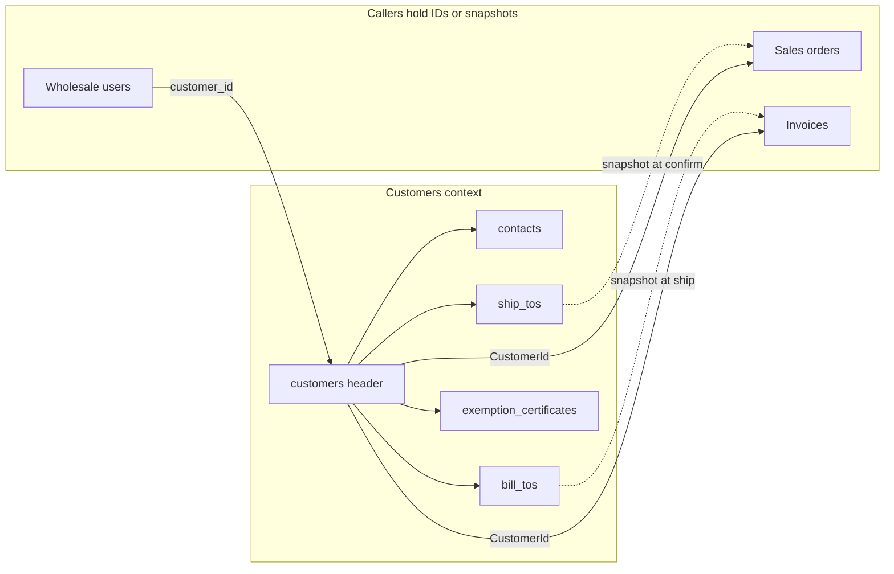

# Customers (v1 master)

Companion to [`architecture.md`](./architecture.md). That document is the module map. This one is **how the wholesale buyer account is stored, created, and gated** so staff can onboard a customer and Sales / Accounting can snapshot the right addresses without re-grilling.

Related: [`invariants.md`](./invariants.md) (§9 U1–U14) · [`database-design.md`](./database-design.md) (tables) · [`api-contract.md`](./api-contract.md) (internal vs wholesale DTOs) · [`tax.md`](./tax.md) (no sales tax) · [`CONTEXT.md`](../CONTEXT.md) § Customers (glossary only).

Wayfinding map: [Customer master data model map](https://linear.app/adamhinckley/issue/ADA-243/customer-master-data-model-map) (decisions closed; this doc is the handoff).

v1 currency is **USD** (`Money.currency` stays; operations are one currency). Every customer is a **reseller** — this company does not sell to taxable end-users. There is **no tax status** on the customer header.

---

## 1. Shape: one header, child records

| Piece | Owns | Does not own |
|---|---|---|
| **Customers** | Account header, contacts, ship-to, bill-to, exemption files + metadata, terms field, credit-limit field, notes, account status | Invoices, sales-tax math, shop login, order history |
| **Sales** | `CustomerId`, ship-to snapshot on the order at confirm | Live ship-to FK after confirm; bill-to |
| **Accounting** | Invoice AR; bill-to snapshot on the invoice at ship; due date from terms | Customer CRUD |
| **Identity** | Wholesale user ↔ `CustomerId` binding at login | Contact rows (contact email ≠ shop user) |

Sales and Accounting hold `CustomerId`, not a Customer aggregate (C4–C5). Credit enforcement at confirm uses `ICreditCheckPort`, not a cross-schema join in Sales (U2).

---

## 2. Customer header

| Field | Required at create | Notes |
|---|---|---|
| **Business name** | Yes | Commercial identity |
| **Terms** | Yes | Payment clock; copied to invoice due date at ship (A2). Free text in v1; Net 30/60/90 enum is still open — see §12 |
| **Credit limit** | Yes | `Money`; `$0` is valid. Formula for what counts against the limit stays G6 (owner-gated) |
| **Customer number** | No (see §3) | Always present after save |
| **Tax ID** | No | Optional reseller identifier on the account |
| **Account status** | No (defaults `active`) | `active` \| `on hold` \| `inactive` — see §8 |
| **Customer note** | No | Empty allowed — see §7 |
| **Staff note** | No | Empty allowed — see §7 |

**First save** is header-only (`POST /customers`). Contacts, ship-tos, bill-to, and exemption certificates use separate endpoints afterward. Default org-wide values for terms and credit limit at create are **not** locked — ask David (§12).

---

## 3. Customer number

Human-readable identifier, unique per organization. Not the UUID `CustomerId`. Visible on **both** internal and wholesale apps (invoices, order history).

| Create input | Result |
|---|---|
| Blank | Customers context assigns next `CUST-#####` (prefix `CUST-`, five-digit pad — same family as `SO-` / `INV-` / `PO-`) |
| Staff-supplied string | Stored as given (migration from a prior system); any non-empty string unique per org |

Immutable after first save on both paths. Bulk import is out of scope for this spec.

---

## 4. Contacts

One or more per customer. Fields: name, email (required), phone (optional). Email is **unique per customer** (not globally).

Contact email is **not** the wholesale login. Identity owns shop users bound to `CustomerId` at login.

**Not required at create.** Which contact receives confirmation or invoice email when several exist is still open — see §12.

---

## 5. Ship-to

One or more destination addresses per customer. Same six fields as today: `line1`, `line2`, `city`, `region`, `postal`, `country`, plus `is_default`.

- Staff may maintain many ship-tos; one may be default.
- **Not required at create.** Confirm needs a ship-to snapshot on the order — staff finish addresses before the first order (or pick at confirm).
- Sales copies the six address fields onto the order at **confirm** (typed snapshot; no live `ship_to_id` on the order).

Staff may **copy default ship-to into bill-to** as a stored duplicate; rows diverge independently afterward (not a live pointer).

---

## 6. Bill-to

**Separate** from ship-to. One row per customer in `bill_tos` (same six address fields; **no** `is_default`; unique on `customer_id`).

| Moment | Rule |
|---|---|
| Create | May be absent |
| Confirm | Does **not** require bill-to |
| Ship | **Refuses** if no bill-to — no shipment, no invoice; staff add bill-to and retry |
| Invoice post | Copies the six bill-to fields onto the invoice (frozen snapshot) |

Sales order does **not** carry bill-to. Only the invoice snapshots it at ship.

---

## 7. Notes

Two distinct free-text fields on the header — not a thread, not one field with a visibility flag.

| Field | Internal app | Wholesale app | Who writes (v1) |
|---|---|---|---|
| **Customer note** | Read | Read | Wholesale customer only (session `customerId`) |
| **Staff note** | Read + edit | **Omit** from wholesale OpenAPI | Staff who can manage customers |

Empty allowed on both. Do not copy either note onto sales orders or invoices.

---

## 8. Account status

`active` \| `on hold` \| `inactive`. Defaults **`active`** on create; staff may set hold or inactive when creating (e.g. migrating a closed account) but are not forced to pick.

Hold is a staff override, not an AR projection. Credit-limit formula (G6) is separate.

| State | Block | Allow |
|---|---|---|
| **On hold** | New confirm; staff place-on-behalf | Edit draft/cart; wholesale login; record payment |
| **Inactive** | New confirm; new drafts/cart; wholesale login; staff place-on-behalf | Record payment on internal app; ship already-confirmed orders |
| **Both** | — | Ship of **already-confirmed** orders (demand committed; bill-to gate still applies) |
| **Active** | — | Everything |

---

## 9. Exemption certificates

Child records on the customer. **No tax status** on the header — every customer is a reseller; this app does not calculate sales tax ([`tax.md`](./tax.md)).

| Field | Required on the row |
|---|---|
| Jurisdiction | Yes |
| Entity-use code | No |
| Expiry | No |
| File (`object_key`) | No |

Wholesale customer or staff may upload the file. Metadata-only rows (no file) are valid.

**Not a gate:** customer may exist, confirm, and ship with zero certificates or only expired ones. Missing/expired is visible only — no auto-flip, no confirm block in v1.

**Not required at create.**

---

## 10. Gates summary

| Gate | Requires |
|---|---|
| Create customer (first save) | Name, terms, credit limit |
| Add contact / ship-to / bill-to / cert | Customer exists |
| Confirm order | Ship-to chosen/snapshot; account status allows; credit check (G6); ATP — not bill-to, not cert |
| Ship order | Bill-to exists on customer |
| Post invoice | Ship succeeded |

---

## 11. Surfaces (internal vs wholesale)

| Data | Internal | Wholesale |
|---|---|---|
| Header + customer number | CRUD (staff) | Read own account |
| Terms, credit limit | Read/write (staff) | Read own (typical shop) |
| Staff note | Read/write | Hidden |
| Customer note | Read | Read + edit own |
| Contacts | CRUD | Read own (TBD on edit) |
| Ship-tos | CRUD | CRUD own |
| Bill-to | CRUD | Read own |
| Exemption certs | CRUD + upload | Read + upload own |
| Account status | Read/write (staff) | Effect only (login/confirm gates) |

Exact wholesale write scope for contacts/addresses follows [`api-contract.md`](./api-contract.md) when wired; gates above are domain truth.

---

## 12. Still open (do not invent in implementation packets)

| Topic | Owner / next step |
|---|---|
| Default values for terms and credit limit at create | Ask David |
| Terms free text vs Net 30/60/90 enum | Product call (G13 successor) |
| Which contact gets confirmation / invoice email | Product call |
| Confirmation email send (`IEmailSender`) | Deferred send-job; confirm use case owns the port when built |
| Statements | Deferred; do not overload Invoice |
| Credit-limit **formula** (G6) | Owner tests — not this master spec |
| Bulk customer import | Out of scope |
| Implementation migration, OpenAPI, demo seed | Separate work packet after this spec |
| **Account request + wholesale agreement** (observed on live SoloView, 2026-09) | Owner grill — see §15. Not U5–U14. Do not treat header **terms** (payment clock) as this document |

---

## 13. What agents may do

| High autonomy | Owner-gated |
|---|---|
| Header CRUD shape, contacts, ship-tos, bill-to CRUD | Credit-limit formula (G6) |
| Certificate file upload + metadata | Account-status enforcement wiring in Sales/Identity |
| Internal vs wholesale DTO mapping (omit staff note wholesale) | Default terms/credit limit until David locks |
| In-memory adapters for all Customers ports | Changing locked U* rules in `invariants.md` |

Do not implement schema, HTTP, or dashboard forms in the wayfinding map session. The implementation packet reads this doc + `database-design.md` + failing owner tests for U5–U14.

---

## 14. Implementation order (customers slice)

Fits [`architecture.md` §13](./architecture.md#13-implementation-order-when-coding-starts). Packets: [ADA-260](https://linear.app/adamhinckley/issue/ADA-260/implement-customer-master-customers-context) → [ADA-261](https://linear.app/adamhinckley/issue/ADA-261/sales-refuse-ship-when-bill-to-missing) → [ADA-262](https://linear.app/adamhinckley/issue/ADA-262/accounting-snapshot-bill-to-on-invoice-at-ship); status gates after 260 as [ADA-263](https://linear.app/adamhinckley/issue/ADA-263/enforce-account-status-gates-sales-identity) (Sales) and [ADA-264](https://linear.app/adamhinckley/issue/ADA-264/identity-wholesale-login-vs-account-status) (Identity).

1. Owner tests encode U5–U9 and U11–U14 in Customers; owner tests encode U10 in Sales and Identity (not in the Customers CRUD packet).
2. Customers migration only: header columns, `bill_tos`, `CUST-` document counter. **Not** invoice snapshot columns.
3. Domain + use cases: create (two number paths), bill-to, status field, notes. Export read ports (bill-to snapshot, account status) for other contexts — not the Customer aggregate.
4. HTTP + OpenAPI: internal full; wholesale own-account read + customer-note edit; omit staff note.
5. Demo seed updates for named customers.
6. Sales ship gate (261), Accounting invoice snapshot columns + copy at ship (262), Sales U10 (263), Identity wholesale login (264).

---

## 15. Account request and wholesale agreement (observed, not locked)

Live SoloView (David Christopher wholesale) for a **new** shop signup:

1. Buyer completes **New Account Registration** (three-step modal — screenshots in [Wholesale screenshots](https://app.notion.com/p/3d00df01ce2e803f9131d35c9666cc9e), 2026-09-03).
2. Staff **approve** the request (internal).
3. Buyer receives a **PandaDoc** email and must sign the legal terms and conditions.
4. Only after that is the buyer a shop-ready wholesale user.

This repo does **not** model that sequence yet. Wholesale `/register` is still mailto (company, email, phone; new vs existing).

### Observed request form (SoloView)

Modal title **New Account Registration**. Close (X). Stepper: 1 Primary Information → 2 Business Credentials → 3 Main Business Address. Previous / Next; step 3 **Submit**. Trade-only copy on step 1 (retailers should use the trade site; 24/7 order management). These screenshots are the **new** path only — existing-account “register for web access” is not shown.

| Step | Fields on screen |
|---|---|
| **1 Primary Information** | Email; how did you hear about us (dropdown); your name; your title; business name; business website |
| **2 Business Credentials** | Country; type of business (dropdown); official resale number certificate. Copy: after register, a copy of authorization for resale or importation of product for retail sales is required and will be verified |
| **3 Main Business Address** | Business name (again); address; address continued; country; postal code; city; state; phone. Checkboxes: retail store front; residential address |

**Clash with locked customer master — do not silently “fix” either side:**

- U5 create is staff header-only (name, payment **terms**, credit limit). This form collects a contact, referral source, website, business type, resale number, and one address **before** any Customer exists.
- U13: exemption certificates are **not** a create/confirm/ship gate. SoloView asks for an official resale number and says a copy of resale/import authorization will be verified.
- One “main business address” is not labeled ship-to vs bill-to. Residential / retail-storefront flags do not exist on the v1 header.
- Header **terms** (payment clock) never appear on this form. The later PandaDoc is the legal **wholesale agreement**.

| What exists today | What does not |
|---|---|
| Staff create a Customer (U5); status defaults `active` | A pending **account request** distinct from a Customer |
| `active` / `on hold` / `inactive` (U10) | A fourth status or “awaiting agreement” state |
| Header **terms** = payment clock (Net 30-style; invoice due date) | A **wholesale agreement** (legal T&Cs). Not the same word as header terms |
| Wholesale `/register` is mailto — customer service enables web access | Identity API for self-serve request; staff approve queue; signature provider |

**Do not invent in packets:** whether the request is its own aggregate vs a Customer created `inactive`; whether unsigned agreement blocks login, confirm, or both; whether PandaDoc is a required vendor vs an `IAgreementPort`; whether existing-account “register for web access” also requires a new signature; which request fields become Customer / contact / ship-to / bill-to vs stay on the request only; whether the resale number (and the promised authorization copy) is required on the request despite U13.

Grill David / product, then lock gates in this doc + `invariants.md` before an implementation packet.
