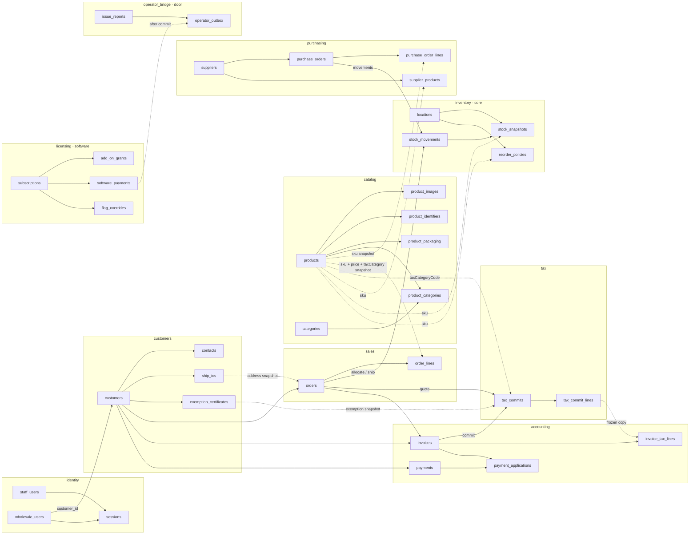
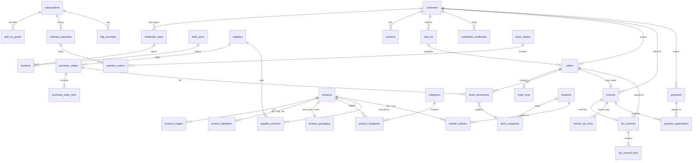
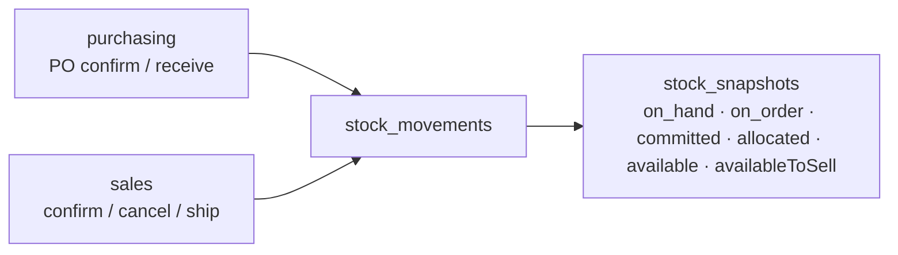
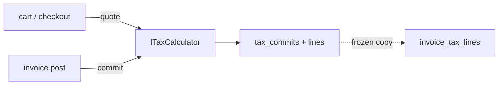

# Database design — table relations (rough draft)

> **Rough draft — not a locked schema.**  
> Starting point for stakeholder review. Use this on a call to confirm how tables connect and which source fields survive.

One Postgres database · schema per context · inventory is the only place quantities are written.

Source dump: product browser CSV (`product_id` … `disc_over_sold_percent`). Field meanings in [`product_browser_schema_glossary.csv`](../product_browser_schema_glossary.csv) are **unverified**. Do not copy that spreadsheet 1:1 into Postgres.

Related: [`architecture.md`](./architecture.md) · [`stack.md`](./stack.md) · [`tax.md`](./tax.md) · [`invariants.md`](./invariants.md) (locked rules; open call items expanded there) · [`licensing.md`](./licensing.md) (software subscription tables are operator-facing) · [`open-questions.md`](./open-questions.md)

---

## Big picture

**Happy path (wholesale):** product → purchase order received → client order (tax **quoted**) → stock allocates → invoice (tax **committed**) & payment.

**Happy path (software):** tenant subscribes → payment to the developer recorded → add-on grant → `IFeatures` flips. Not the same tables as customer AR.

---

## Entity relationships

---

## Relations list

| From | To | Link | Notes |
| --- | --- | --- | --- |
| `wholesale_users` | `customers` | `customer_id` | Bound at login |
| `sessions` | staff or wholesale user | `actor_type` + `actor_id` | Opaque cookie session |
| `product_images` | `products` | `product_id` | Bytes in object storage |
| `products` | — | `tax_category_code` | Engine tax code, **not** a percent |
| `product_identifiers` | `products` | `product_id` | UPC, mfg, alt codes — typed, not ten columns |
| `product_packaging` | `products` | `product_id` | Inner pack / case / ship carton |
| `product_categories` | `products` + `categories` | both FKs | Source dump used `category_1`…`category_10` as tags |
| `purchase_orders` | `suppliers` | `supplier_id` | |
| `supplier_products` | `suppliers` + `products` | both | Vendor SKU, min order, last PO cost |
| `purchase_order_lines` | `purchase_orders` | `purchase_order_id` | Lines freeze sku/name |
| `stock_snapshots` | `locations` | `location_id` | Plus `sku` |
| `reorder_policies` | `locations` | `location_id` | Plus `sku`; min/max on-hand |
| `contacts` | `customers` | `customer_id` | |
| `ship_tos` | `customers` | `customer_id` | Default and extra ship-to addresses |
| `exemption_certificates` | `customers` | `customer_id` | File in object storage; metadata + expiry |
| `orders` | `customers` | `customer_id` | ID only — not a nested aggregate |
| `orders` | `ship_tos` | snapshot columns | Copy address at order time |
| `order_lines` | `orders` | `order_id` | Lines freeze sku/name/price/`tax_category_code` |
| `stock_movements` | PO or order | `ref_type` + `ref_id` | Ledger provenance |
| `stock_snapshots` | — | `sku` + `location_id` | Read model; updated with each movement |
| `tax_commits` | order and/or invoice | `order_id`, `invoice_id` | Engine transaction id; quoted vs committed vs voided |
| `tax_commit_lines` | `tax_commits` | `tax_commit_id` | Jurisdiction, `rate_bps`, taxable base, tax `Money` |
| `invoices` | `orders` | `order_id` | `subtotal` / `tax_total` / `total` as integer minor units + currency |
| `invoice_tax_lines` | `invoices` | `invoice_id` | Frozen copy of committed tax lines; never recomputed |
| `invoices` | `customers` | `customer_id` | Denormalized for AR lists |
| `payments` | `customers` | `customer_id` | |
| `payment_applications` | `payments` + `invoices` | both FKs | Supports partial pay |
| `add_on_grants` | `subscriptions` | `subscription_id` | Paid or complementary pack |
| `software_payments` | `subscriptions` | `subscription_id` | Money **to the developer**; not customer AR |
| `flag_overrides` | `subscriptions` | `subscription_id` | Operator force-on / force-off |
| `issue_reports` | — | local `issue_id` | Saved here first; forwarded later |
| `operator_outbox` | — | `idempotency_key` unique | Fail-soft messages to the other repo |

### Intentionally not a live FK

| From | Toward catalog | Instead |
| --- | --- | --- |
| `purchase_order_lines` | `products` | Copy **sku / name** at write time |
| `order_lines` | `products` | Copy **sku / name / unit_price / tax_category_code** at write time |
| `invoice_tax_lines` | engine / tax tables | Copy committed amounts; do not re-quote a posted invoice |

History must not change when the catalog, a rate, or the engine changes later.

---

## What the CSV is (and is not)

The product browser export is **one wide row per SKU**: catalog copy, vendor, costs, three flavors of quantity, sales totals, ten category slots, and packaging stacked together.

That is a **report**, not a table. In this design:

- Catalog owns identity, copy, flags, prices, dimensions, packaging, identifiers, category tags.
- Purchasing owns suppliers and per-supplier product terms.
- Inventory owns location, ledger, snapshot quantities, and reorder min/max.
- Sales / reports own MTD–lifetime sales — **do not store those as product columns.**

v1 still has one warehouse for ATP (`LocationId` exists so more locations are additive). Source `location` codes (`XJB`, `TA`, `YT`, …) look like bins or vendor-area codes; they become `locations`, not extra qty columns on `products`.

---

## Proposed tables (catalog + inventory + purchasing)

Columns are a first cut from the glossary. Money is integer cents. Quantities are integers in sell UOM unless noted.

### `catalog.products`

| Column | Source field | Notes |
| --- | --- | --- |
| `id` | — | Internal UUID |
| `sku` | `product_id` | Unique; stock-keeping identity |
| `name` | `item` | |
| `description` | `detail` | Often empty in the dump |
| `secondary_name` | `item2` | Drop if unused after review |
| `uom` | `uom` | Sell / inventory unit |
| `country_of_origin` | `c_of_o` | |
| `material` | `material` | Sparse |
| `length` `width` `height` `diameter` `size` | matching | Product body, not carton |
| `weight` `weight_uom` | `wt` `wt_uom` | |
| `list_price_cents` | `lp_price` | Wholesale list — confirm |
| `member_price_cents` | `mp_price` | Meaning of LP vs MP is unverified |
| `original_wholesale_price_cents` | `original_wholesale_price` | History vs current price? |
| `catalog_page` | `catalog_pg_num` | |
| `default_order_qty` | `def_qty` | Cart / PO default |
| `default_weight` `default_weight_uom` | `def_wt` `def_wt_uom` | Fallback when `weight` is 0 |
| `inactive` | `inactive` | Hide from normal use |
| `discontinued` | `discontin` | |
| `non_stock` | `non_stock` | Do not track as regular inventory |
| `no_export` | `no_export` | |
| `web_wholesale` | `webwholesale` | Shop visibility |
| `web_retail` | `webretail` | Out of v1 shop scope; keep the flag |
| `oversold_discount` | `disc_over_sold` | Policy flag — confirm |
| `oversold_discount_bps` | `disc_over_sold_percent` | Store as basis points |
| `line_commission` | `line_comm` | Flag vs amount — unverified |
| `carton_to_carton` | `c_to_c` | **Unknown meaning** — do not guess in code |

**Not on `products`:** any on-hand / pick-list / on-order qty, `loc_onhand`, vendor name, PO dates, sales totals.

### `catalog.product_identifiers`

One row per code. Replaces `upcode`, `mfg_code`, `alt_code`, `alt2_code`, `alt3_code`.

| Column | Notes |
| --- | --- |
| `product_id` | FK |
| `kind` | `upc` \| `mfg` \| `alt` |
| `code` | Unique per kind where it matters (UPC) |

### `catalog.product_packaging`

One row per product (v1). Source used `pkg_*`, `ip_*`, `cs_*`.

| Column | Source |
| --- | --- |
| `pack_length` `pack_width` `pack_height` `pack_weight` `pack_weight_uom` | `pkg_*` |
| `inner_pack_qty` | `ip_qty` |
| `inner_pack_l/w/h/weight` + uom | `ip_*` |
| `case_qty` | `cs_qty` |
| `case_l/w/h/weight` | `cs_*` |

### `catalog.categories` + `catalog.product_categories`

Source `category_1`…`category_10` are **tags / collections**, not a 10-level tree (a SKU can be in Shopify + a colorway + a seasonal set). Many-to-many. No order required unless merchandising wants one.

### `purchasing.suppliers`

| Column | Source field |
| --- | --- |
| `id` | — |
| `vendor_number` | `vendor_num` |
| `name` | `vendor` |

### `purchasing.supplier_products`

Per supplier × SKU. Source put vendor mins and costs on the product row.

| Column | Source field | Notes |
| --- | --- | --- |
| `supplier_id` `sku` | | |
| `supplier_sku` | `mfg_code` if that is the vendor item | Confirm vs identifiers table |
| `min_order_qty` | `vendor_min_order` | |
| `min_order_amount_cents` | `min_order_amt` | |
| `last_po_cost_cents` | `po_cost` | Convenience copy; PO lines are history |
| `standard_cost_cents` | `standard_cost` | Valuation — often 0 in the dump |

### `inventory.locations`

| Column | Source field | Notes |
| --- | --- | --- |
| `id` | — | `DEFAULT` for v1 ATP |
| `code` | `location` | `XJB`, `TA`, `SUP`, … |
| `is_pick_bin` | `pickbin` | Dump is TRUE/FALSE, **not** a slot name — glossary may be wrong |

### `inventory.reorder_policies`

| Column | Source field |
| --- | --- |
| `sku` `location_id` | |
| `min_on_hand` | `onhand_min_qty` |
| `max_on_hand` | `onhand_max_qty` |

### `inventory.stock_snapshots` (read model only)

Written only by inventory, from `stock_movements`. **Never** a CRUD field on product.

| Snapshot field | Source field | Meaning in v1 |
| --- | --- | --- |
| `on_hand` | `onhand_qty` / `loc_onhand` | Receipts − shipments − adjustments |
| `committed` | — | Confirmed sales not yet shipped or decommitted (pre-sold) |
| `allocated` | `onpicklist_qty` | Warehouse cover against `on_hand` (not the confirm gate) |
| `on_order` | `on_order_qty` | Open PO qty not yet received |
| `available` | — | `on_hand − allocated` (derived; warehouse leftover) |
| `availableToSell` | — | Open: no cap. Locked: `on_hand + on_order − committed` ([ADR 0008](./adr/0008-available-to-sell-open-locked.md)) |
| `sell_state` | — | `open` \| `locked` per SKU per organization |

If `onhand_qty` and `loc_onhand` diverge in the dump, that is a source-system bug or multi-bin total vs location qty — call it out on import, do not invent a third quantity.

---

## Source fields we do **not** persist as product columns

These are projections. Rebuild them from documents / the ledger / reports.

| Source field | Where it lives instead |
| --- | --- |
| `onhand_qty` `loc_onhand` | `stock_snapshots.on_hand` |
| `onpicklist_qty` | `stock_snapshots.allocated` |
| `on_order_qty` | `stock_snapshots.on_order` |
| `v_on_order` | Unverified (qty vs $). If qty, same as `on_order`; if $, sum open PO lines |
| `open_po_cnt` | Count of open POs for the SKU |
| `next_po` `next_qty` | Earliest open PO date + remaining qty |
| `mtd_sales` `ytd_sales` `last_yr_sales` `all_sales` | Sales report queries |

---

## Inventory in the middle

Purchasing and sales never write quantity columns. They emit movements; inventory updates the snapshot in the same transaction.

`available` = `on_hand − allocated` (warehouse leftover). `availableToSell` is the shop/staff sellable number ([ADR 0008](./adr/0008-available-to-sell-open-locked.md)). `uncovered = max(0, committed − on_hand − on_order)` is the factory to-order list.

---

## Tax

Checkout **quotes**; invoice post **commits**. Stock allocate and tax HTTP are not one database transaction. See [`tax.md`](./tax.md).

`products.tax_category_code` is a code, not a percent. Rates live in the engine.

---

## Open on the call

Canonical checklist (kept in sync with Slack): [`open-questions.md`](./open-questions.md). UI surfaces: [`surfaces/`](./surfaces/). [`invariants.md`](./invariants.md) §18 restates the order/ATP/credit gaps with recommended v1 defaults.

1. Invoice on **confirm** or on **ship**? (Tax **commits** at that same moment.)
2. Separate **cart** table, or draft **orders**?
3. Any missing documents for day one (credit memo, RMA, blanket PO)?
4. Hosted engine: **Avalara AvaTax** (default for wholesale resale) vs cheaper Stripe Tax if few-nexus?
5. Confirm **LP vs MP vs original wholesale** — which one is the shop price?
6. What is **`c_to_c`**? Keep, drop, or rename once someone who uses the current system says.
7. Is **`pickbin`** a boolean, or should we model named slots later?
8. Are **`category_*`** merchandising tags (proposed) or a real hierarchy?
9. Keep **`web_retail`** for a future storefront, or drop it in v1?
10. **`line_comm` / oversold discount** — in catalog, or a later pricing/commission context?
11. When importing the dump, treat **`onhand_qty` vs `loc_onhand`** mismatches as errors or as “use location qty”?

Software subscription tables above are **operator-facing** (the developer billing this tenant). They are not part of the wholesale glossary call. See [`licensing.md`](./licensing.md). `issue_reports` / `operator_outbox` are the door to a **separate** developer monorepo — [`operator-bridge.md`](./operator-bridge.md).
