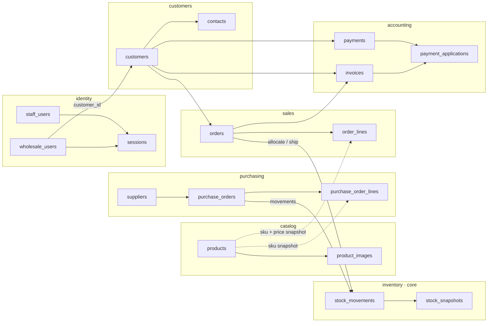
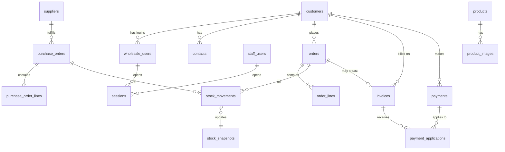
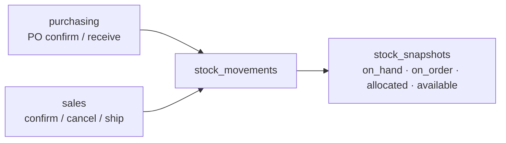

# Database design — table relations (rough draft)

> **Rough draft — not a locked schema.**  
> Starting point for stakeholder review. Use this on a call to confirm how tables connect.

One Postgres database · schema per context · inventory is the only place quantities are written.

Related: [`architecture.md`](./architecture.md) · [`stack.md`](./stack.md) · [`invariants.md`](./invariants.md) (locked rules; open call items expanded there)

---

## Big picture

**Happy path:** product → purchase order received → client order → stock allocates → invoice & payment.

---

## Entity relationships

---

## Relations list

| From | To | Link | Notes |
| --- | --- | --- | --- |
| `wholesale_users` | `customers` | `customer_id` | Bound at login |
| `sessions` | staff or wholesale user | `actor_type` + `actor_id` | Opaque cookie session |
| `product_images` | `products` | `product_id` | Bytes in object storage |
| `purchase_orders` | `suppliers` | `supplier_id` | |
| `purchase_order_lines` | `purchase_orders` | `purchase_order_id` | Lines freeze sku/name |
| `contacts` | `customers` | `customer_id` | |
| `orders` | `customers` | `customer_id` | ID only — not a nested aggregate |
| `order_lines` | `orders` | `order_id` | Lines freeze sku/name/price |
| `stock_movements` | PO or order | `ref_type` + `ref_id` | Ledger provenance |
| `stock_snapshots` | — | `sku` + `location_id` | Read model; updated with each movement |
| `invoices` | `orders` | `order_id` | |
| `invoices` | `customers` | `customer_id` | Denormalized for AR lists |
| `payments` | `customers` | `customer_id` | |
| `payment_applications` | `payments` + `invoices` | both FKs | Supports partial pay |

### Intentionally not a live FK

| From | Toward catalog | Instead |
| --- | --- | --- |
| `purchase_order_lines` | `products` | Copy **sku / name** at write time |
| `order_lines` | `products` | Copy **sku / name / unit_price** at write time |

History must not change when the catalog is edited later.

---

## Inventory in the middle

Purchasing and sales never write quantity columns. They emit movements; inventory updates the snapshot in the same transaction.

`available` = `on_hand − allocated` (derived). v1 does not sell against inbound PO qty.

---

## Open on the call

These three are still open. [`invariants.md`](./invariants.md) §18 restates them with recommended v1 defaults and the other gaps they imply (ATP reject-all, credit formula, PO receive, statements).

1. Invoice on **confirm** or on **ship**?
2. Separate **cart** table, or draft **orders**?
3. Any missing documents for day one (credit memo, RMA, blanket PO)?
