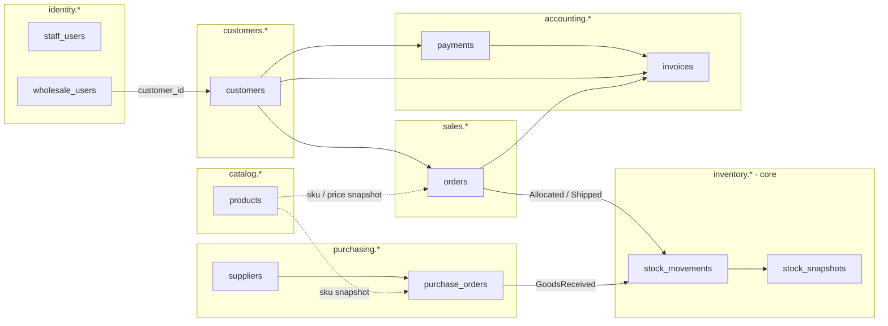
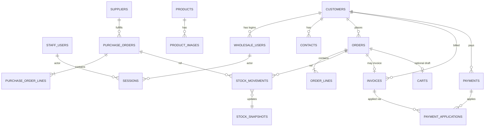
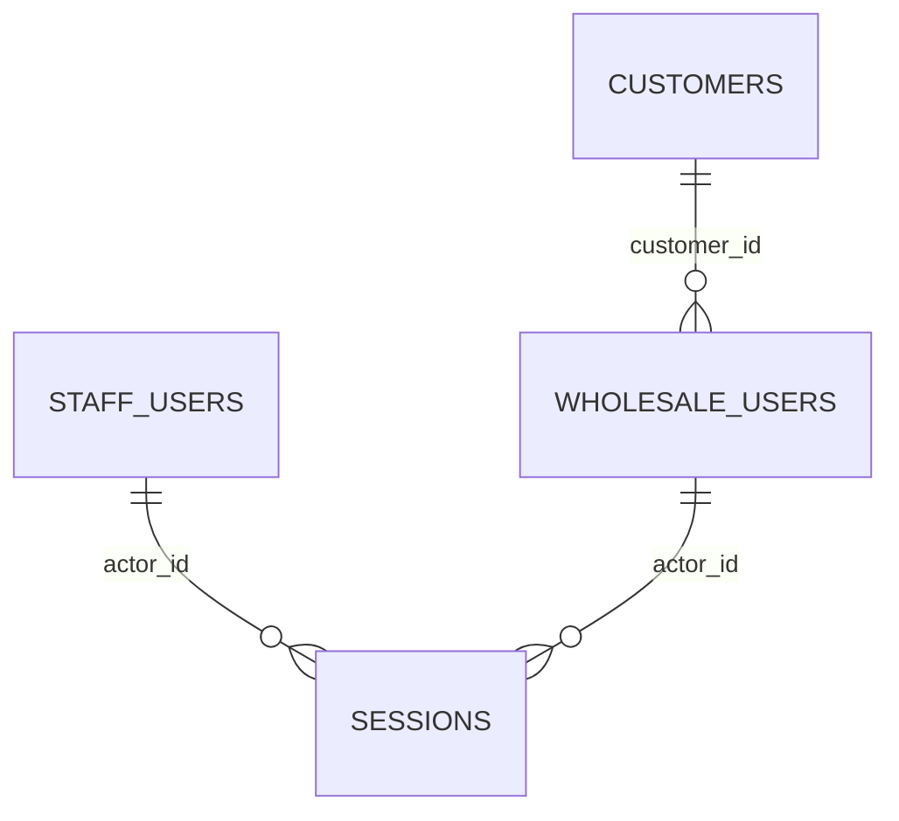
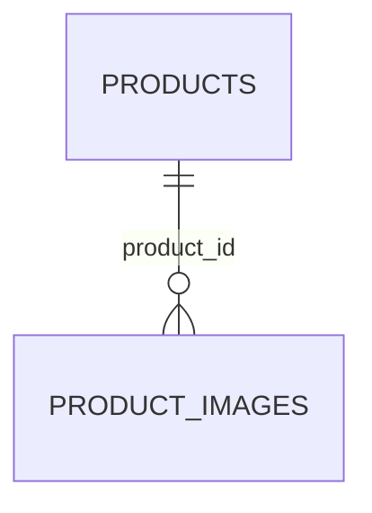
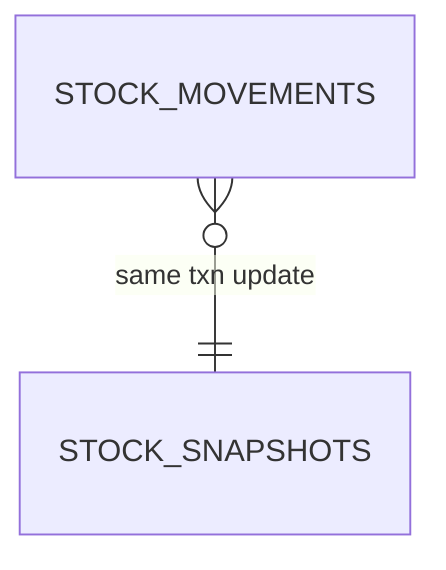
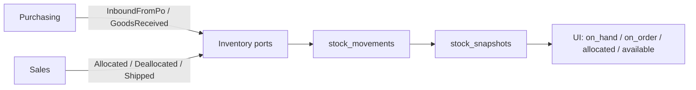
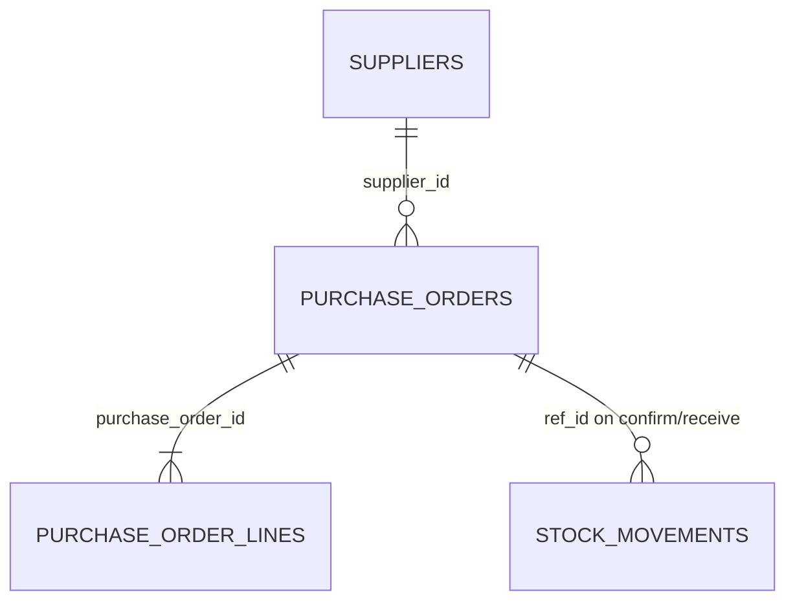
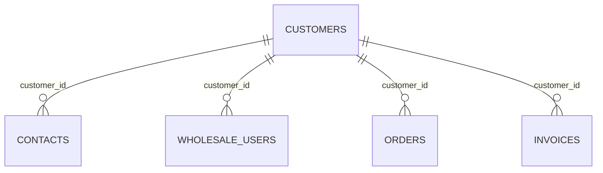
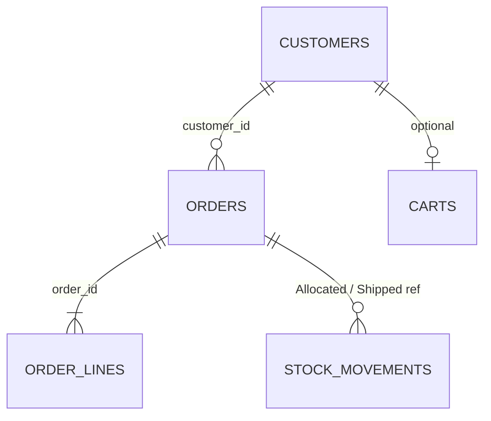
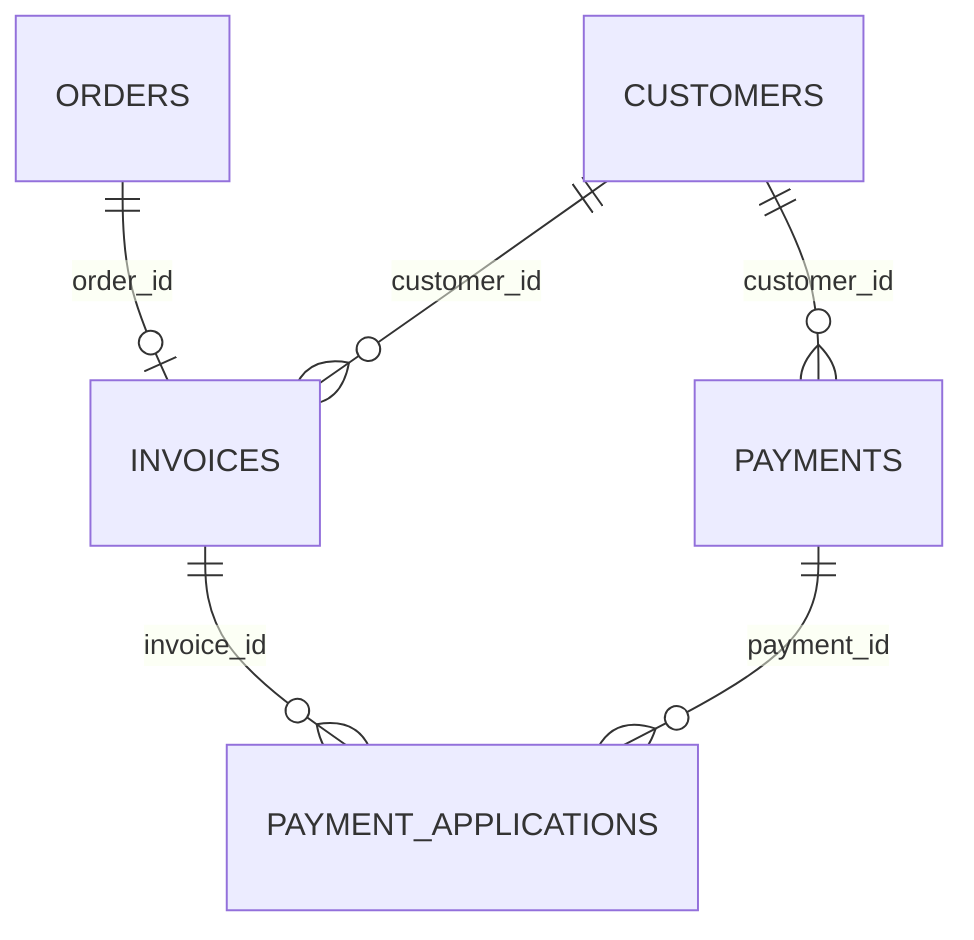

# Database design (rough draft)

> **Rough draft — not a locked schema.**  
> Starting point for stakeholder review. Names, columns, and status enums will change. Use this on a call to mark what to keep, cut, or rename.

Wholesale inventory control · one Postgres database · **schema per bounded context**.

Related: [`architecture.md`](./architecture.md) · [`stack.md`](./stack.md) · [`api-contract.md`](./api-contract.md)

---

## Ground rules

| Decision | Meaning |
| --- | --- |
| **Ledger, not a qty column** | On-hand / on-order / allocated come from `inventory.stock_movements`. `available` is always derived (`on_hand − allocated`), never typed in. |
| **Schema per business area** | `identity`, `catalog`, `inventory`, `purchasing`, `customers`, `sales`, `accounting` — no cross-schema joins inside write use cases. |
| **Integers only** | Money = `bigint` cents. Quantities = `int`. IDs = `uuid`. SKUs = unique `text`. |

**v1 policy:** clients cannot sell against inbound PO qty. Inbound is shown (`on_order`), not sellable.

---

## How the schemas relate

Happy path on a call: product exists → PO received into inventory → client orders → stock allocates → invoice & payment.



Cross-context links are **IDs or frozen snapshots**, not live foreign aggregates. Inventory is the **only** writer of quantities.

---

## Entity–relationship overview



---

## `identity.*` — who can sign in

Two audiences, separate session cookies. Wholesale users are bound to a customer at login — the client never picks another account’s id.

### `staff_users`

| Column | Type | Notes |
| --- | --- | --- |
| **id** PK | uuid | |
| email | text | Unique login |
| password_hash | text | Via auth adapter only |
| roles | text[] | e.g. `admin`, `purchasing`, `warehouse` |
| active | boolean | Disable without delete |
| created_at | timestamptz | |

### `wholesale_users`

| Column | Type | Notes |
| --- | --- | --- |
| **id** PK | uuid | |
| **customer_id** FK → `customers.customers` | uuid | Bound at login; ignore body |
| email | text | Unique shop login |
| password_hash | text | Same hashing path as staff |
| active | boolean | |
| created_at | timestamptz | |

### `sessions`

| Column | Type | Notes |
| --- | --- | --- |
| **id** PK | text / uuid | Opaque cookie value |
| actor_type | enum | `staff` \| `wholesale` |
| actor_id | uuid | Staff or wholesale user |
| expires_at | timestamptz | Revocable server-side |
| created_at | timestamptz | |



---

## `catalog.*` — what we sell

No stock counts here. Image **bytes** live in object storage; Postgres keeps keys and metadata only.

### `products`

| Column | Type | Notes |
| --- | --- | --- |
| **id** PK | uuid | ProductId |
| sku | text | Unique stock-keeping identity (v1) |
| name | text | |
| description | text | Nullable |
| list_price_cents | bigint | Integer minor units |
| wholesale_price_cents | bigint | Shop price |
| status | text | `active` \| `archived` … |
| created_at / updated_at | timestamptz | |

### `product_images`

| Column | Type | Notes |
| --- | --- | --- |
| **id** PK | uuid | |
| **product_id** FK → `products` | uuid | |
| object_key | text | S3/R2 key — not a blob |
| sort_order | int | Gallery order |
| content_type | text | jpeg / png / webp |



---

## `inventory.*` — the hard part (owner-gated)

Movements are the source of truth. The snapshot updates in the **same transaction** so staff and clients never see a stale available.

```
available = on_hand − allocated
v1: clients cannot sell against inbound PO qty
```

### `stock_movements` (append-only ledger)

| Column | Type | Notes |
| --- | --- | --- |
| **id** PK | uuid | |
| sku | text | Stock identity |
| location_id | text | v1 always `DEFAULT` |
| type | enum | See movement types below |
| qty | int | Sense depends on type |
| ref_type | text | `purchase_order` \| `sales_order` \| `adjustment` … |
| ref_id | uuid | Document that caused the move |
| occurred_at | timestamptz | |
| created_at | timestamptz | |

**Movement types**

| Type | Effect |
| --- | --- |
| `InboundFromPo` | ↑ `on_order` when PO confirmed |
| `GoodsReceived` | ↓ `on_order`, ↑ `on_hand` |
| `Allocated` | ↑ `allocated` on sales confirm |
| `Deallocated` | ↓ `allocated` on cancel / reject |
| `Shipped` | ↓ `allocated`, ↓ `on_hand` |
| `Adjustment` | Explicit on-hand correction (owner-gated) |

### `stock_snapshots` (read model)

| Column | Type | Notes |
| --- | --- | --- |
| **sku + location_id** PK | text + text | Locked `FOR UPDATE` on allocate |
| on_hand | int | Receipts − shipments − adjustments |
| on_order | int | Open PO qty not yet received |
| allocated | int | Confirmed sales not yet shipped |
| available | int **derived** | `on_hand − allocated` (generated or computed) |
| updated_at | timestamptz | Same txn as movement |





---

## `purchasing.*` — bringing stock in

PO documents live here. Receiving emits inventory movements — purchasing never updates on-hand directly. PDF is a projection stored by object key.

### `suppliers`

| Column | Type | Notes |
| --- | --- | --- |
| **id** PK | uuid | |
| name | text | |
| email | text | Optional |
| phone | text | Optional |
| notes | text | |

### `purchase_orders`

| Column | Type | Notes |
| --- | --- | --- |
| **id** PK | uuid | |
| **supplier_id** FK → `suppliers` | uuid | |
| status | text | `draft` \| `confirmed` \| `partial` \| `received` \| `cancelled` |
| ordered_at | timestamptz | |
| pdf_object_key | text | Generated outbound PDF; nullable |
| created_at | timestamptz | |

### `purchase_order_lines`

| Column | Type | Notes |
| --- | --- | --- |
| **id** PK | uuid | |
| **purchase_order_id** FK → `purchase_orders` | uuid | |
| sku | text | Snapshot at order time |
| name | text | Snapshot |
| qty_ordered | int | |
| qty_received | int | Updated on receive |
| unit_cost_cents | bigint | Optional for v1 |



---

## `customers.*` — who buys wholesale

Customer master data only. Orders hold a `CustomerId`; they do not nest inside the customer row.

### `customers`

| Column | Type | Notes |
| --- | --- | --- |
| **id** PK | uuid | CustomerId |
| name | text | Account / trade name |
| billing_address | jsonb | Shape TBD on call |
| payment_terms | text | e.g. Net 30 |
| credit_limit_cents | bigint | Checked via port at checkout |
| status | text | `active` \| `on_hold` … |
| created_at / updated_at | timestamptz | |

### `contacts`

| Column | Type | Notes |
| --- | --- | --- |
| **id** PK | uuid | |
| **customer_id** FK → `customers` | uuid | |
| name | text | |
| email | text | |
| phone | text | |
| is_primary | boolean | |



---

## `sales.*` — wholesale orders

Line items freeze product name and unit price at order time (snapshot). Confirming an order asks inventory to allocate; inventory may reject if available is too low.

### `orders`

| Column | Type | Notes |
| --- | --- | --- |
| **id** PK | uuid | OrderId |
| **customer_id** FK → `customers` | uuid | ID only — not a joined aggregate |
| status | text | `draft` \| `confirmed` \| `shipped` \| `cancelled` … |
| placed_at | timestamptz | |
| currency | text | Stored with money |
| source | text | `wholesale_shop` \| `internal_behalf` |
| created_at / updated_at | timestamptz | |

### `order_lines`

| Column | Type | Notes |
| --- | --- | --- |
| **id** PK | uuid | |
| **order_id** FK → `orders` | uuid | |
| sku | text | From catalog port at add-to-order |
| name_snapshot | text | Frozen for history / PDFs |
| unit_price_cents | bigint | Frozen wholesale price |
| qty | int | Allocated on confirm |

### `carts` *(optional — open question)*

| Column | Type | Notes |
| --- | --- | --- |
| **id** PK | uuid | Or reuse draft `orders` instead |
| **customer_id** FK → `customers` | uuid | |
| lines | jsonb / child table | Shape TBD |
| updated_at | timestamptz | |



---

## `accounting.*` — AR slice only

Invoices and payments — not a full general ledger. Customer balance = invoices − payments (projection).

**Open policy:** invoice on confirm vs on ship — pick one for v1.

### `invoices`

| Column | Type | Notes |
| --- | --- | --- |
| **id** PK | uuid | |
| **order_id** FK → `sales.orders` | uuid | |
| **customer_id** FK → `customers` | uuid | Denormalized for AR lists |
| status | text | `open` \| `partial` \| `paid` \| `void` |
| total_cents | bigint | |
| issued_at | timestamptz | |
| due_at | timestamptz | |
| pdf_object_key | text | Generated PDF; nullable |

### `payments`

| Column | Type | Notes |
| --- | --- | --- |
| **id** PK | uuid | |
| **customer_id** FK → `customers` | uuid | |
| amount_cents | bigint | Recorded payment — not a card vault |
| received_at | timestamptz | |
| method / reference | text | TBD |

### `payment_applications`

| Column | Type | Notes |
| --- | --- | --- |
| **payment_id** FK → `payments` | uuid | |
| **invoice_id** FK → `invoices` | uuid | |
| amount_cents | bigint | Supports partial pay |
| PK | (payment_id, invoice_id) | Or surrogate uuid |



---

## Relation cheat sheet

| From | To | How | Why |
| --- | --- | --- | --- |
| `wholesale_users` | `customers` | `customer_id` | Session binding |
| `product_images` | `products` | `product_id` | Gallery |
| `purchase_orders` | `suppliers` | `supplier_id` | Vendor |
| `purchase_order_lines` | `purchase_orders` | `purchase_order_id` | Lines |
| `contacts` | `customers` | `customer_id` | People |
| `orders` | `customers` | `customer_id` | Buyer |
| `order_lines` | `orders` | `order_id` | Lines |
| `stock_movements` | PO / order | `ref_type` + `ref_id` | Ledger provenance |
| `stock_snapshots` | — | keyed by `sku` + `location_id` | ATP read model |
| `invoices` | `orders` | `order_id` | Bill from sale |
| `invoices` / `payments` | `customers` | `customer_id` | AR |
| `payment_applications` | payment + invoice | both FKs | Partial apply |

**Not a DB FK (by design):** sales/purchasing → live `catalog.products`. They copy **sku / name / price** snapshots at write time so history does not drift when the catalog changes.

---

## v1 boundary

| In v1 | Not in this draft |
| --- | --- |
| One warehouse (`location_id = DEFAULT`) | Multi-warehouse transfers / per-site ATP |
| SKU as stock identity | Product variants as first-class rows |
| Available = on-hand − allocated | Selling against inbound PO qty |
| AR: invoices + payments | General ledger, AP, inventory valuation |
| File metadata in Postgres; bytes in object storage | Separate read replica / CQRS database |

---

## Talking points for the call

1. **Does “available” mean on-hand minus allocated?** Confirm we will not let clients order against stock still on a PO.
2. **When does an invoice appear?** On confirm, or on ship? Pick one policy for v1.
3. **Cart: separate table or draft order?** Decide which language the business prefers.
4. **Customer credit & holds** — Is credit limit enough, or do we need on-hold flags, per-customer pricing, or multiple ship-to addresses in v1?
5. **What must staff see that clients must never see?** Cost, supplier, other customers’ orders stay off wholesale reads.
6. **Names & missing tables** — Anything the warehouse team calls differently? Any document (credit memo, RMA, blanket PO) required on day one?
