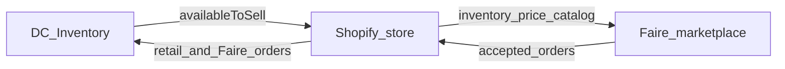

# Shopify channel

External marketplace hub for **retail Shopify** and **Faire wholesale** (via Shopify’s Faire: Sell Wholesale app). **Planned** ([ADR 0009](../adr/0009-shopify-channel-hub.md), [Shopify channel project](https://linear.app/adamhinckley/project/shopify-channel-86c419ea2311), map [ADA-265](https://linear.app/adamhinckley/issue/ADA-265/shopify-channel-implementation-map)). Must stay additive: a bridge package and mapping tables, not Shopify types in Sales/Catalog/Inventory and not a native Faire API.

Do not implement until Demand model (`availableToSell`) and Sales confirm/commit packets are green.

Related: [`../architecture.md`](../architecture.md) · [`../stack.md`](../stack.md) · [`../adr/0008-available-to-sell-open-locked.md`](../adr/0008-available-to-sell-open-locked.md)

---

## Language

**Shopify channel** — the integration. One GraphQL Admin API + webhooks. Not a fourth Next.js app.

**Retail order** — placed on Shopify Online Store (`sourceName` typically `web`). Shopify collected payment.

**Faire order** — placed on Faire, accepted there, then copied into Shopify by Faire: Sell Wholesale. Wholesale. Faire collected payment (retailer Net 60 is Faire’s problem). Shopify payment status on the copy is ops display, not a card charge.

**Shopify bridge** — planned context (`packages/shopify-bridge`). Anti-corruption layer. Same family as operator-bridge: local inbox table, in-memory tests, no network in unit tests.

Do not call Faire “Shopify wholesale.” Do not call retail checkout “Faire.”

---

## Pipeline (today vs target)

Today: SoloView → Shopify inventory; Faire app reads Shopify location qty; Faire orders optionally land in Shopify.

Target: **DC Inventory → Shopify** (inventory, later catalog/fulfillment); **Shopify → DC Inventory** (orders, two kinds). Faire stays configured on Shopify.



---

## What Shopify needs vs what Faire needs

Faire’s retailer UI is Faire’s product. This backend does not serve Faire checkout.

| Flow | Direction | Meaning |
|---|---|---|
| Inventory | DC → Shopify | Absolute qty via `inventorySetQuantities` (GraphQL). Value is `availableToSell`. |
| Orders | Shopify → DC | Webhook (`orders/create` / `orders/paid`) + reconciliation pull. Branch retail vs Faire. |
| Fulfillment | DC → Shopify | Tracking after `ShipSalesOrder`. Faire admin fulfillment does **not** auto-update Faire; still mark fulfilled on Faire. |
| Catalog | DC → Shopify (later) | Link existing variants by SKU first. Push new products only when a packet says so. |
| Money | — | Retail: Shopify captured. Faire: Faire pays the brand (commission + payout-speed fees). Direct wholesale shop: existing AR. |

Inventory is usually **one Shopify location pool**. Channel split is on **orders**, not two independent stock numbers, unless a later packet uses a Faire-only location.

---

## Prerequisites

1. [ADR 0008](../adr/0008-available-to-sell-open-locked.md) live — otherwise Shopify and Faire oversell locked SKUs.
2. Sales draft → confirm (`Committed`) → ship against `Allocated`.
3. Partner **development store** + custom app (Dev Dashboard). Bogus Gateway or Shopify Payments test mode. GraphQL: `https://{shop}.myshopify.com/admin/api/{version}/graphql.json`.
4. Production: public HTTPS webhook URL on the API host.

### First-time Shopify setup (API-only)

This integration is a server that calls Admin GraphQL — **not** an App Store / Remix app. Shopify’s own path for that:

1. Open the [Dev Dashboard](https://shopify.dev/docs/apps/build/dev-dashboard) (free Partner account). Prefer **Use the Dev Dashboard** over Shopify CLI (“Best for automation or API-only apps with no admin UI”).
2. Follow **[Create apps using the Dev Dashboard](https://shopify.dev/docs/apps/build/dev-dashboard/create-apps-using-dev-dashboard)** — create app, release a version (scopes + webhook API version), install on a store. Shopify wrote this for “connecting an existing system to Shopify.”
3. Create a **[dev store](https://shopify.dev/docs/apps/build/dev-dashboard/stores/development-stores)** (Stores → Create store → Dev). No paid plan; no real charges.
4. Get a token with **[Authenticate an app for stores in your organization](https://shopify.dev/docs/apps/build/dev-dashboard/get-api-access-tokens)** (client credentials; tokens expire in 24h). Then POST GraphQL: [About GraphQL](https://shopify.dev/docs/apps/build/graphql).

Do not create a new **legacy** custom app in the merchant admin (blocked since 2026-01-01). David’s existing SoloView app, if any, can keep running until cutover.

---

## Package and HTTP (when packets open)

```
packages/shopify-bridge/
  domain/        # mapping types, ports — no Shopify SDK
  application/   # PushInventory, IngestShopifyOrder, PushFulfillment
  adapters/      # GraphQL client, HMAC verify, Postgres mapping + inbox
  tests/         # in-memory; no network
```

Fastify: `POST /webhooks/shopify` (HMAC, insert inbox, 200). Internal staff: connect/status, retry, “push inventory now” — OpenAPI + Orval, not hand-written fetch.

Idempotency: `X-Shopify-Event-Id` plus Shopify order id. Unknown `sourceName` → staff queue, do not guess.

---

## Phases

| Phase | Work |
|---|---|
| 1 | OAuth/token, SKU mapping, inventory push, webhook inbox |
| 2 | Order ingest: retail vs Faire → existing Sales use cases |
| 3 | Fulfillment to Shopify; document Faire’s second hop |
| 4 | Catalog link / optional product push |

---

## Explicitly out of this note

- Native Faire Partner API (still [`../invariants.md`](../invariants.md) §17)
- Redis, Kafka, Shopify EventBridge as required infra
- GraphQL as **this product’s** API (stack rejection unchanged)
- Inventing Faire net-settlement math, open-SKU Shopify sentinel qty, or a retail Customer model without owner tests
