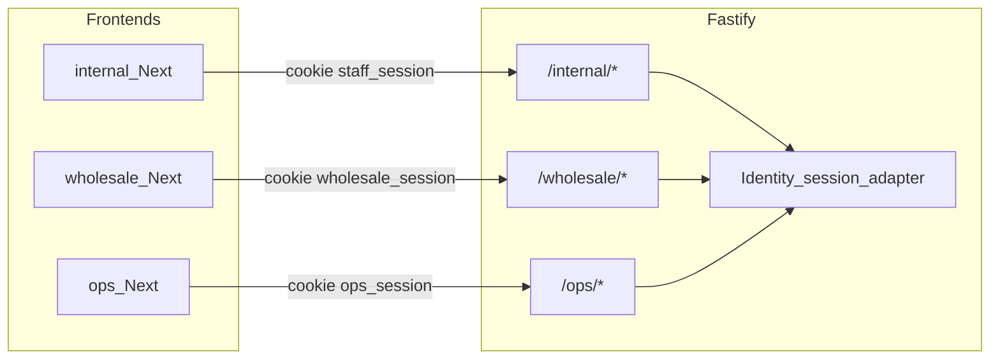

# Stack, database, and security

Companion to [`architecture.md`](./architecture.md). That document is the module map. This one is the **concrete technology** the solo software operator and coding agents (any vendor) should use, and how auth is enforced.

UI tables, shop vs dashboard, OpenAPI, and Orval are specified in [`api-contract.md`](./api-contract.md). Internal dashboard color, type, and dark opt-in tokens are in [`work-dashboard-design-spec.md`](./work-dashboard-design-spec.md) (Carbon hex, semantic names, AppShell). Wholesale shop tokens stay in `apps/wholesale` and follow the same layout principles ([ADR 0006](./adr/0006-vendor-design-system.md)). Sales tax is **out of v1** ([`tax.md`](./tax.md)). Logs, errors, uptime, and cheap alerts that become agent work packets are in [`observability.md`](./observability.md). Locked domain and module rules are in [`invariants.md`](./invariants.md). Software subscription is [`licensing.md`](./licensing.md). The operator platform is [`operator-bridge.md`](./operator-bridge.md). Planned Shopify Admin GraphQL (outbound) is [`future-concepts/shopify-channel.md`](./future-concepts/shopify-channel.md).

Choices optimize for four things, in order:

1. **Correctness** for inventory, money, and **distinct audiences** (staff, wholesale clients, ops)
2. **Changeability** — mid-build requirement flips stay local (use cases + additive OpenAPI); see [`architecture.md` §2a](./architecture.md#2a-change-friendly-api-and-modules) and [`api-contract.md` §7](./api-contract.md#7-api-evolution-when-requirements-change)
3. **Agent accuracy** — boring, typed, heavily documented tools agents implement without inventing a new style
4. **Solo software ops** — one database, managed hosting, no extra runtime for the builder to babysit

---

## 1. Why TypeScript, not a mixed stack

Agents are more accurate when the whole repo is **one language with a compiler**.

| Pick | Why |
|---|---|
| **TypeScript, `strict: true`** | Ports, DTOs, and `Money` are types. The compiler catches the mistakes agents make (wrong id, missing field, stringly-typed qty). |
| **pnpm workspaces** | Simple monorepo. Agents already know `packages/*` + `apps/*`. |
| **Vitest** | Fast unit tests with in-memory adapters; the agent’s stop condition is “tests green.” |

**Not Python for this repo.** FastAPI is fine in isolation, but two (or three) React frontends plus a Python API means agents context-switch, duplicate types, and drift OpenAPI by hand. One language beats a second “ideal” backend ecosystem.

**Not a second backend later.** Do not add a Go/Rust service for “performance.” Inventory correctness is transactional, not CPU-bound.

---

## 2. Recommended stack (v1)

```
apps/
  api/                 Fastify — composition root, /internal, /wholesale, /ops
  internal/            Next.js — staff dashboard (tables, reports, charts)
  wholesale/           Next.js — wholesale e-commerce (browse, cart, checkout)
  ops/                 Next.js — operator + business owner (subscription, payment history, flags)
packages/
  shared-kernel/       Money, Sku, branded IDs (pure TS)
  identity/ …          domain / application / adapters / tests
  licensing/ …
  catalog/ …
  inventory/ …
  …
```

| Layer | Choice | Why this, not the alternative |
|---|---|---|
| API framework | **Fastify 5** | Thin HTTP adapter. Domain stays framework-free. Nest’s decorators and module DI leak into “services” and agents put business rules in controllers. |
| Validation (HTTP only) | **Zod** | Parse at the adapter. Never put Zod on domain entities. |
| SQL access | **Drizzle + `postgres.js`** | SQL-shaped, transactions, `FOR UPDATE`, integer columns. Prisma hides SQL; agents generate N+1 and cannot express a stock ledger cleanly. |
| Database | **PostgreSQL 18** (16+ still accepted) | See [§4](#4-database-postgresql). |
| Frontends | **Three Next.js 16 apps (Turbopack)** | Internal = dashboard. Wholesale = e-commerce. Ops = licensing control plane. Not one app with three route groups. Ops may later deploy separately; it still talks to `/ops`. `next dev` / `next build` use Turbopack; do not add a `webpack()` key in `next.config.ts`. Repo-root `.mcp.json` (and `.cursor/mcp.json`) registers `next-devtools-mcp`, which discovers each app’s `/_next/mcp` during `next dev` (internal :3000, wholesale :3002). |
| Charts (internal only) | **Recharts** | Huge training data for agents. Draws series from report endpoints. Do not chart raw list pages. |
| Client data | **TanStack Query via Orval** | Hooks generated from OpenAPI. No hand-written `fetch`. |
| API contract for UIs | **OpenAPI 3 from Zod + Fastify swagger**; three specs (internal / wholesale / ops); **Orval** clients; `x-table` for search/filter UI | Frontends are presentation-only. See [`api-contract.md`](./api-contract.md). |
| Files | **S3-compatible** (R2/S3) via `IFileStorage` | Images, import uploads, generated PDFs, attachments. Bytes never live on the API disk. |
| Spreadsheets | **exceljs** (XLSX) + **csv-parse / csv-stringify** (CSV) behind `IWorkbookParser` / `IWorkbookWriter` | Domain sees rows of fields, not Excel. In-memory fake in tests. |
| PDFs (outbound) | **PDFKit** (or `@react-pdf/renderer`) behind `IPdfRenderer` | Render PO/invoice from aggregates. Tests assert on a fake renderer, not PDF pixels. |
| Auth library | **Better Auth** (or equivalent session library) **as an Identity adapter only** | See [§5](#5-authentication-and-authorization). |
| Software billing | **`ISoftwareBillingGateway`** — manual record in v1; **Stripe** as an adapter when charging cards | Domain never imports Stripe types. See [`licensing.md`](./licensing.md). |
| Feature flags | **`IFeatures`** in-process from Licensing Postgres | Not LaunchDarkly in v1. Not `if (process.env.FLAG)` scattered in domain. |
| Operator platform | **`IOperatorPlatform` no-op** + local outbox/issues | HTTPS later. Not Kafka. Not this repo. See [`operator-bridge.md`](./operator-bridge.md). |
| Passwords | Library default (**Argon2id** / scrypt) | Never roll bcrypt-by-hand in a use case. |
| Hosting (solo software ops) | Managed Postgres (Neon, RDS, or Supabase **as Postgres only**). API on Fly/Render/Railway. Frontends on Vercel. | No Kubernetes. Do not use Supabase Auth, Storage, or RLS as the domain. |
| Sales tax | **None.** Reseller-only; no engine, no tax lines. | Do not add AvaTax, Stripe Tax, `ITaxCalculator`, or `price * rate`. See [`tax.md`](./tax.md). |
| Observability | **Pino** JSON logs + **`requestId`**, **Sentry** (or free equivalent) on API + Next apps, **`GET /health`** (+ optional `/ready`), free uptime ping, host metrics only | No Datadog/New Relic, no self-hosted Prometheus/Grafana/ELK, no OTel collector in v1. See [`observability.md`](./observability.md). |

### Explicitly rejected (v1)

| Rejected | Reason |
|---|---|
| MongoDB / DynamoDB / Firestore | No multi-row ACID for allocate-then-write-order. Inventory will desync. |
| MySQL as primary | Works, but weaker constraints/`FOR UPDATE` habits; agents and examples for ledgers are Postgres-first. |
| SQLite in production | Fine for unit tests only. |
| Prisma as the only data layer | Poor fit for a movement ledger and row locks. |
| NestJS | Too much framework in the center; agents violate the dependency rule. |
| GraphQL / tRPC | Extra surface **as this product’s API**. REST + generated OpenAPI + Orval is the UI contract. Shopify **Admin GraphQL** is an outbound adapter when [Shopify channel](./future-concepts/shopify-channel.md) packets open — not a reason to add GraphQL to Fastify. |
| JSON `filters` blob / OData on query strings | Not self-describing in OpenAPI; tables would guess. Explicit query params only. |
| Elasticsearch / Meilisearch (v1) | Table `q` is Postgres `ILIKE` / `pg_trgm`. |
| Redis (v1) | Sessions and rate-limit counters live in Postgres until you have a reason. |
| Next.js Route Handlers as the domain API | Mixes UI deploy with inventory transactions; several frontends would duplicate or awkwardly share routes. Fastify is the one composition root. |
| Clerk/Auth0 as the source of truth for customers | Fine as a later IdP **adapter**. v1 keeps users in our DB so `CustomerId` binding stays in-process. |
| Kubernetes, Kafka, Elasticsearch | Solo-software-operator tax. |
| Puppeteer/Playwright to “print HTML to PDF” as the default renderer | Heavy runtime. Fine later; v1 is a library renderer. |
| Metabase / Superset / Cube in v1 | Extra ops. Dashboard reports are Fastify query endpoints + Recharts. |
| Homegrown `taxPercent` / per-state rate tables | v1 does not collect sales tax ([`tax.md`](./tax.md)). |
| Tax SDK (AvaTax, Stripe Tax, etc.) | No sales-tax engine. |
| OCR / LLM parsing of supplier PDFs in v1 | Unreliable; store as attachment instead. |
| LaunchDarkly / Statsig / Unleash as a **required** runtime | Extra vendor and SDK in every app. v1 is `IFeatures` in-process. Allowed later **as** that port. |
| Stripe types in `domain/` | Stripe is `ISoftwareBillingGateway`. Manual payment recording must work in tests without Stripe. |
| Datadog / New Relic / self-hosted ELK or Prometheus+Grafana (v1) | Solo-software-operator tax and cost. Free error tracking + uptime + host logs only — [`observability.md`](./observability.md). |
| OpenTelemetry collector as a default runtime | Extra process. Sentry breadcrumbs + structured logs cover v1. |

---

## 3. How the stack maps to Clean Architecture

```
Next.js apps          → driving UI (not domain)
Fastify routes        → driving HTTP adapters (parse, auth, call one use case)
Zod DTOs              → adapter layer only
Drizzle schemas       → persistence models, mapped to/from domain in repositories
S3/R2 SDK             → IFileStorage adapter
exceljs / csv-*       → IWorkbookParser / IWorkbookWriter
PDFKit                → IPdfRenderer
Better Auth           → Identity adapter (sessions, cookies, password hash)
Stripe SDK            → ISoftwareBillingGateway adapter (optional v1)
domain/ + application/→ pure TypeScript, no Fastify/Drizzle/Better Auth/Stripe/tax-SDK imports
```

**Rule agents must follow:** if a file is under `domain/` or `application/`, it must compile with no Node HTTP, Drizzle, auth-library, or Stripe imports. Tests inject in-memory adapters.

---

## 4. Database: PostgreSQL

**Use PostgreSQL as the only system of record** (plus object storage for image bytes).

This product is a **transactional ledger**. Allocation must not oversell: confirm order and insert `Allocated` in **one transaction**, with a row lock on that SKU’s snapshot (or an equivalent unique movement constraint). That is what Postgres is for.

### How to model it

| Data | Storage |
|---|---|
| Money | `BIGINT` integer **minor units** + ISO `currency` (CHAR(3)). Scale is the currency’s exponent (USD=2, JPY=0) — not a hardcoded `/100`. Never `FLOAT`/`REAL`/`DOUBLE`. v1 invoice and line totals are merchandise `Money` only — no sales-tax lines or Tax adapter. |
| Quantities | `INTEGER` (or `BIGINT`). Never float. |
| IDs | `UUID` (`gen_random_uuid()`). |
| SKU | `TEXT` with a unique constraint. |
| Enumerations | Postgres enums **or** text + check constraint; map to TS union types in the adapter. |
| Product image bytes | **Not in Postgres.** Store object key + metadata only. |
| Product / order snapshots | Columns, or `JSONB` for a frozen `ProductSnapshot` on a line item — not a live join to catalog at read time for historical orders. |
| Availability | Movement table is source of truth; snapshot table (`on_hand`, `on_order`, `allocated`) updated **in the same transaction**. `available` is `on_hand - allocated` (generated column or computed in the repository). |

### Transactions and locking (Inventory)

On sales confirm (sketch of the invariant, not production SQL):

1. `BEGIN`
2. Lock the SKU snapshot row (`SELECT … FOR UPDATE`)
3. If `on_hand - allocated < requested` → abort
4. Insert `Allocated` movement; update snapshot
5. Save the sales order
6. `COMMIT`

Do not check availability in the app, then write in a second round trip with no lock. Agents will try that; tests and this rule forbid it.

### One database, schema-per-context

Stakeholder-facing starting draft of tables, columns, and relations: [`database-design.md`](./database-design.md) (rough draft — not a locked migration).

One Postgres cluster, one database. **Separate schemas** (or table-name prefixes) per bounded context so agents do not join `catalog.products` from a Sales use case:

```
identity.*
catalog.*
inventory.*
purchasing.*
sales.*
customers.*
accounting.*
licensing.*
operator_bridge.*
```

Cross-context data is copied as IDs/snapshots at write time, not queried via cross-schema joins inside a use case. Reporting views can join later; they are not the write model.

### What not to add in v1

- **Row Level Security** as the primary authz mechanism — easy to get wrong; application + session binding is the v1 gate. RLS can be defense-in-depth later.
- **Read replicas / CQRS read DB** — same instance until it hurts.
- **Extensions** beyond `pgcrypto`/`uuid` and **`pg_trgm`** (for list `q` search). No `citext` maze, no stored-procedure business logic. Invariants live in TypeScript domain + use cases so tests do not need Postgres.

### Migrations

Drizzle Kit (or equivalent) migrations in version control. Agents may add a migration **for their context’s schema only**. Inventory snapshot/ledger migrations are owner-gated.

---

## 5. Authentication and authorization

Identity is a bounded context. Better Auth (or similar) is an **adapter**, not the domain. Domain entities are `StaffUser`, `WholesaleUser`, and **`OperatorUser` / ops business-owner** (or a single `User` with an actor type). The library stores credentials and sessions; use cases still own “what this actor is allowed to do.”

### Three apps, three sessions, one API



| Audience | Frontend origin (example) | Cookie | API prefix |
|---|---|---|---|
| Staff | `https://internal.example.com` | `staff_session` | `/internal` |
| Wholesale client | `https://shop.example.com` | `wholesale_session` | `/wholesale` |
| Operator / business owner | `https://ops.example.com` | `ops_session` | `/ops` |

**Separate cookie names and separate origins.** A wholesale session must not be accepted on `/internal` or `/ops`, and vice versa. CORS allowlists **exactly** those three origins.

Staff must not administer feature flags. That is ops only ([`licensing.md`](./licensing.md)).

### Session, not bearer JWT in localStorage

| Decision | Detail |
|---|---|
| Mechanism | **Server-side session** (opaque id in cookie, row in Postgres). Revocable (logout, disable user, password change). |
| Cookie flags | `HttpOnly`, `Secure`, `SameSite=Lax`, `Path` scoped to audience prefix (`/internal`, `/wholesale`, `/ops`), short idle timeout + absolute lifetime. |
| Where not to put tokens | `localStorage`, query strings, logs. |
| CSRF | Distinct sites + `SameSite=Lax` covers the v1 browser apps. If a cookie is ever shared cross-site, add anti-CSRF tokens. |
| Passwords | Hash via the auth adapter. Never log passwords. |
| Login abuse | Rate-limit `/internal/auth/*`, `/wholesale/auth/*`, and `/ops/auth/*` (Postgres or middleware counter). |

JWT **access tokens** are optional later for mobile. They are not v1. If added, keep them short-lived and still bind `customerId` server-side.

### Actor model

| Actor | Bound at login | Can never be trusted from the client body |
|---|---|---|
| **Staff** | `staffUserId` + roles (`admin`, `purchasing`, `warehouse`, …) | Role elevation |
| **Wholesale user** | `wholesaleUserId` + **`customerId`** | `customerId`, another customer’s `orderId` |
| **Operator** | `operatorUserId` | Force-on flags without `IFeatureFlagAdmin` |
| **Business owner** | ops user + **`tenantId`** | Complementary grants, operator overrides |

Wholesale handlers **overwrite** `customerId` from the session after Zod parse. If the body contains a customer id, ignore it.

Staff “place order on behalf of customer” is an **internal** use case that takes `customerId` from the staff DTO and still goes through credit + allocation ports.

### Authorization layers

1. **Edge (Fastify preHandler):** valid session, correct cookie for the route tree, staff vs wholesale vs ops.
2. **Staff RBAC:** role required for the route or use case (e.g. only purchasing creates POs). Start with a small static matrix in Identity; do not build a dynamic permission CMS in v1.
3. **Entitlements:** `IFeatures` at the adapter for paid packs. Not a substitute for (2) or for stock/credit rules.
4. **Business rules in use cases:** credit limit, allocation failure, “cannot modify a submitted order.” These are domain/application, not middleware.
5. **Resource scoping:** wholesale `GetOrder` loads by id **and** `customerId` from session. Missing row and other-customer’s row look the same (`404`), not `403` with existence leak if you can avoid it.

Coding agents may wire login, cookies, and “require session” hooks. **Permission matrix, session `customerId` binding, and credit/stock gates are owner-reviewed** ([architecture.md §10](./architecture.md#10-ai-agent-operating-model-build-time)).

### Images and uploads

- Staff-only upload endpoints (or presign staff-only).
- Presigned PUT to R2/S3: allowlist `Content-Type` (jpeg/png/webp), max size, random object key (not the original filename as the key).
- Public read for product images that are meant to be on the wholesale catalog; otherwise signed GET.
- Metadata in `catalog`; bytes only in object storage.
- Spreadsheet imports and generated PDFs: staff-only (unless a wholesale export exists in that spec). Same MIME allowlist and size caps as OpenAPI. Do not treat an uploaded XLSX as trusted SQL.

### Secrets and headers

- Secrets only in environment / host secret store. Never commit `.env` with real values.
- Fastify `helmet`-equivalent: disable unused methods, conservative `Content-Type` on APIs.
- Do not return stack traces to clients. Log internally.
- HTTPS only in production; cookies `Secure`.

### What v1 does not include

- SSO / SAML
- API keys for third parties
- Fine-grained per-SKU permissions
- Postgres RLS as the main customer isolator
- Storing card PANs (use `ISoftwareBillingGateway` / a payments adapter; AR v1 and software billing can both “record a payment” without being a card vault)

---

## 6. What agents should generate vs leave alone

| Agents may implement | Owner specifies / reviews |
|---|---|
| Fastify route + Zod DTO + call use case | Inventory lock + movement math |
| Drizzle schema for **their** context | Shared-kernel `Money` / `Sku` |
| In-memory fake of an existing port | Authz matrix, cookie names, CORS origins |
| Next.js page using Orval hooks + `DataTable` meta | Session `customerId` overwrite rule |
| List filters as Zod query params + `x-table` (then `gen:api`) | Inventing undocumented query params or browser-side filtering |
| Presigned-upload adapter behind `IFileStorage` | Any “available qty” stored as an input |
| CSV/XLSX export + import dry-run for Catalog/Customers | Stock-count spreadsheet that writes on-hand; PDF line-item extraction |
| Gate a route with existing `IFeatures` / `FeatureName` | Inventing flag names, mixing software payments into Accounting, LaunchDarkly |
| No-op `IOperatorPlatform` + issue form against existing use case | Inventing message kinds, requiring the other repo at boot, Kafka “for the bridge” |
| Pino/`requestId`, `/health`, Sentry SDK wiring (no secrets in logs) | Alert routing, PII-in-logs policy, paid APM |

If an agent adds Redis, Prisma, Mongo, GraphQL, tRPC, Elasticsearch, JWT-in-localStorage, hand-written `fetch` to the API, Datadog, a metrics/log microservice, or a tax SDK, reject the PR. The stack is closed until this document (and [`observability.md`](./observability.md) / [`tax.md`](./tax.md) / [`licensing.md`](./licensing.md)) changes.

---

## 7. Minimal local/prod picture

```
Browser cookie
    → Next.js (internal or wholesale)
        → Fastify (/internal or /wholesale)
            → Identity adapter (session row in Postgres)
            → one use case
                → domain
                → ports → Drizzle (Postgres) and/or S3
```

**Local:** Docker Compose with Postgres (and optionally MinIO for S3). Unit tests do not start Compose; they use in-memory adapters.

**Prod:** Managed Postgres, managed object storage, one API process, two or three frontend deploys (ops may share a host or wait), free-tier error tracking + uptime on `/health`, host log stream. That is the entire runtime — details in [`observability.md`](./observability.md).
