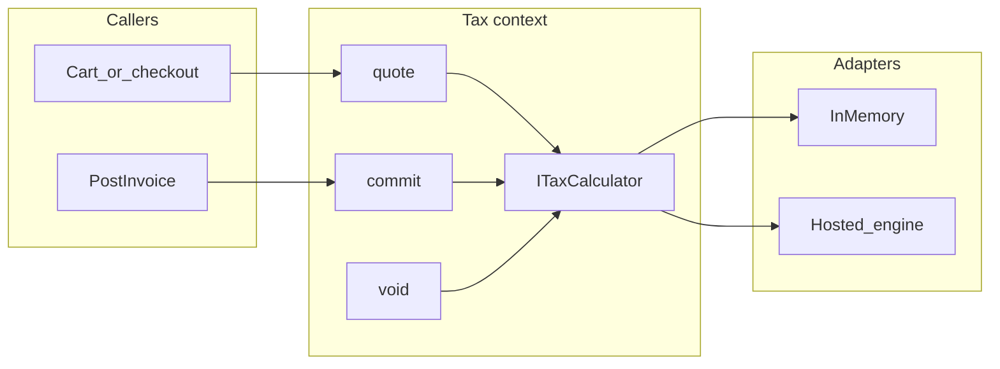

# Tax (v1 path)

Companion to [`architecture.md`](./architecture.md). That document is the module map. This one is **how tax is quoted, committed, and stored** so a wholesale shop can check out without multiplying rates in Sales or in the UI.

Related: [`stack.md`](./stack.md) (hosted engine as an adapter) · [`database-design.md`](./database-design.md) (tables) · [`api-contract.md`](./api-contract.md) (checkout / invoice DTOs).

v1 **includes a tax engine**. It does **not** include a tax department in TypeScript. Calculation is a port; a hosted engine is the production adapter; invoices freeze the result.

---

## 1. Why this is in v1

Wholesale checkout and invoices are legally wrong if tax is “add later.” Most of this company’s customers will be **resale-exempt** in some jurisdictions and **taxable** in others. That is an engine problem (destination, tax category, certificate, date), not a `taxPercent` column on `products`.

What v1 must be able to do on day one:

- Show tax on wholesale cart/checkout (a **quote**)
- Put tax on a posted **invoice** (a **commit**)
- Store exemption certificates against a customer
- Survive the engine being swapped without rewriting historical invoices

What v1 does **not** do: file returns, chase expiring certificates as a product, compute use tax on purchase orders, or build a US nexus spreadsheet in our database.

---

## 2. Shape: port, not a rate table in Sales

Tax is a bounded context (`packages/tax`) with a thin domain and a driven port. Sales and Accounting **call the port**. They never import Avalara/Stripe SDKs and never do `price * rate`.



| Piece | Owns | Does not own |
|---|---|---|
| **Tax** | `ITaxCalculator`, quote/commit/void, engine transaction ids, frozen tax lines on the tax commit record | Customer master, product marketing, invoice AR balance |
| **Catalog** | `taxCategoryCode` on the product (not a rate) | Jurisdictions, certificates |
| **Customers** | Ship-to addresses; exemption **certificate files + metadata** | Tax math |
| **Sales** | Builds a tax document from order + snapshots; shows quote on checkout | Rounding policy, engine HTTP |
| **Accounting** | Invoice `subtotal` / `taxTotal` / `total`; copies committed tax lines onto the invoice | Calling the engine except via Tax use cases |

### Port (sketch of the invariant, not production TypeScript)

```
ITaxCalculator
  quote(doc, idempotencyKey?) → TaxQuote      // preview; not filed
  commit(doc, idempotencyKey) → TaxCommit     // authoritative; on invoice post
  void(commitId) → void                       // invoice void / cancel before filing
```

`TaxDocument` is a snapshot the caller already has:

- `customerId`
- `shipFrom` / `shipTo` (address snapshots)
- lines: `sku`, qty, unit `Money`, `taxCategoryCode`, discounts
- exemption snapshot: entity-use / resale code, certificate id, or “none”
- document `Money.currency`

`TaxQuote` / `TaxCommit` return:

- line-level and document-level `taxAmount` as **`Money`** (integer minor units + currency)
- jurisdiction / tax name / `rateBps` (integer basis points) **for audit display**
- engine transaction id (on commit)

Convert engine floats **in the adapter**, immediately, into `Money`. Domain never sees `0.0875`.

**Fail closed.** If the engine is down or returns garbage, do not confirm an order or post an invoice with `tax = 0`. Retry. Do not “skip tax so checkout works.”

**Do not hold Inventory locks across the HTTP call.** Allocate stock in a Postgres transaction; quote/commit tax is a separate I/O. If invoice post fails after a successful commit, **void** (or retry with the same idempotency key). If commit fails after the invoice row exists, leave the invoice unposted and retry.

---

## 3. Quote vs commit (when numbers become real)

| Moment | Call | Meaning |
|---|---|---|
| Cart / checkout / staff “place order for customer” | `quote` | What we **show**. May change if ship-to or lines change. |
| Sales confirm + Inventory allocate | **Not** a tax commit | Stock is our ledger; tax is not committed here. Persist the last quote on the order as informational. |
| Invoice **posted** (confirm vs ship — same policy as Accounting) | `commit` | Legal amount. Frozen on the invoice. Never recomputed from today’s engine. |
| Invoice voided before filing | `void` | Tell the engine it did not happen. |
| Destination changes between quote and invoice | `quote` again, then `commit` | Do not commit the stale cart quote. |

Invoice-on-confirm vs invoice-on-ship is still an Accounting policy pick. Tax **commits when the invoice posts**, whichever that is. That is the clear path: stock and tax are two commits, not one distributed transaction.

---

## 4. Money, rounding, FX

Same `Money` as the rest of the system: **integer minor units + ISO currency**. Scale comes from the currency (JPY is not `/100`). See [`stack.md`](./stack.md).

- The **engine’s rounded `taxAmount`** is what we store. We do not re-round in Sales, Accounting, or the UI.
- `rateBps` is display/audit, not something to multiply later.
- Multi-currency conversion is still out of v1 **beyond storing `Money.currency`**. If a document is USD, tax is USD. Do not convert tax in the adapter “as a convenience.”

---

## 5. Exemptions (wholesale)

Exemptions are **customer data**, snapshotted onto the tax document:

| Field | Where |
|---|---|
| Certificate file | `IFileStorage` (object key on the customer) |
| Metadata | Customers: jurisdiction / exposure zone, entity-use or resale code, expiry, status |
| Applied at quote/commit | Passed into `ITaxCalculator`; the engine decides if it applies to **this** ship-to |

Staff upload and expiry dates are high-autonomy CRUD. **Whether checkout treats the customer as exempt** is owner-gated (it is a money path). Agents must not invent “this SKU is always 0% tax.”

v1 stores certificates ourselves. Full certificate-lifecycle products (Avalara CertCapture, auto-renewal campaigns) are a later adapter, not a reason to skip `ITaxCalculator` now.

---

## 6. Production adapter vs tests

| Environment | Adapter | Why |
|---|---|---|
| Unit tests | **In-memory** `ITaxCalculator` | Deterministic quotes/commits; no network. Required, like every other port. |
| Local / CI | In-memory, or engine **sandbox** on an integration job | Do not make every agent PR hit a paid API. |
| Staging / prod | **Hosted tax engine** | Real jurisdictions + exemptions. |

**Default production engine: Avalara AvaTax** (or equivalent quote/commit/void API). Wholesale resale certificates and destination tax are what that class of product is for.

**Acceptable cheaper substitute:** Stripe Tax (or similar) **only if** the company is few-nexus and staff are willing to treat exemptions as our certificate files plus a code on the request — not a full certificate CMS. The **port stays AvaTax-shaped** (quote / commit / void + lines + addresses + exemption snapshot) so swapping later is an adapter PR, not a Sales rewrite.

Rejected as the production calculator:

- `product.taxPercent` or `state = 'UT' → 7.25`
- UI or Fastify controller multiplying money by a float
- A second microservice

Nexus monitoring, return filing, remittance, and use tax on POs are **not** v1. When they appear, they are more adapters (or the engine’s own dashboard), not new domain math.

---

## 7. What agents may do

| High autonomy | Owner-gated |
|---|---|
| `taxCategoryCode` on Catalog CRUD | `ITaxCalculator` semantics, fail-closed, idempotency |
| Customer ship-to CRUD | Mapping exemption → engine entity-use codes |
| Certificate **file upload** + metadata fields | Commit on invoice post; void on invoice void |
| HTTP DTOs that **display** quoted/committed tax from the API | Choosing or swapping the hosted engine |
| In-memory adapter that satisfies existing tests | “Engine down → tax 0” |

Coding agents must not add a tax vendor SDK inside `packages/sales` or `packages/accounting`. The SDK lives in `packages/tax/adapters`.

---

## 8. Implementation order (tax slice)

Fits into [`architecture.md` §13](./architecture.md#13-implementation-order-when-coding-starts):

1. Catalog has `taxCategoryCode`; Customers have ship-to + certificate metadata.
2. Owner writes failing unit tests for quote/commit/void + fail-closed.
3. In-memory adapter + Tax use cases go green.
4. Hosted-engine adapter (sandbox) behind the same port.
5. Wholesale cart/checkout **quotes** before confirm; UI only formats `Money`.
6. Accounting **commits** when the invoice posts; invoice PDF prints frozen tax lines.
7. Confirm still allocates inventory without wrapping engine HTTP in the `FOR UPDATE` transaction.

Do not launch the wholesale shop without step 5. Do not post live invoices without step 6.
